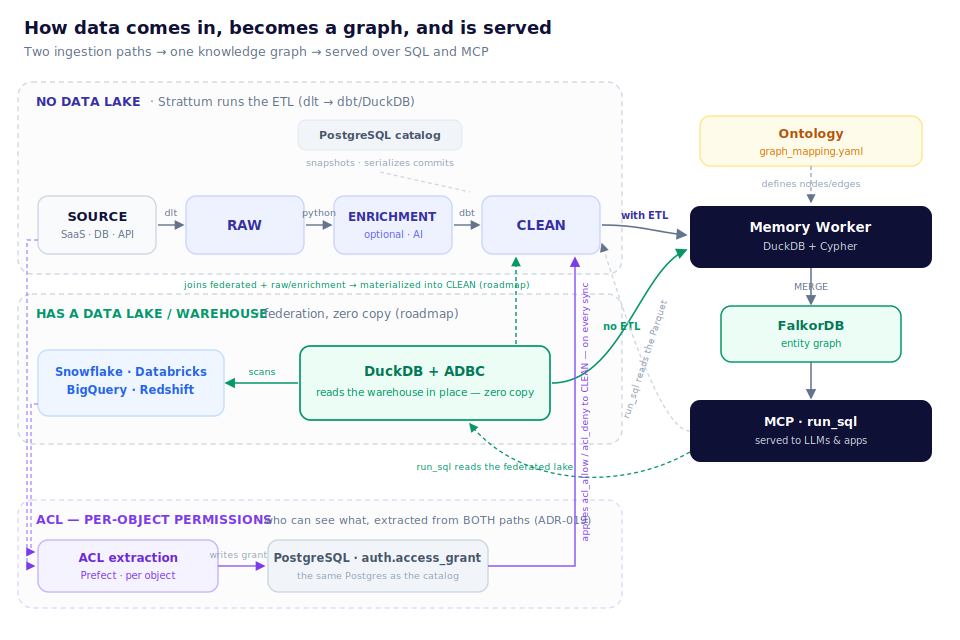
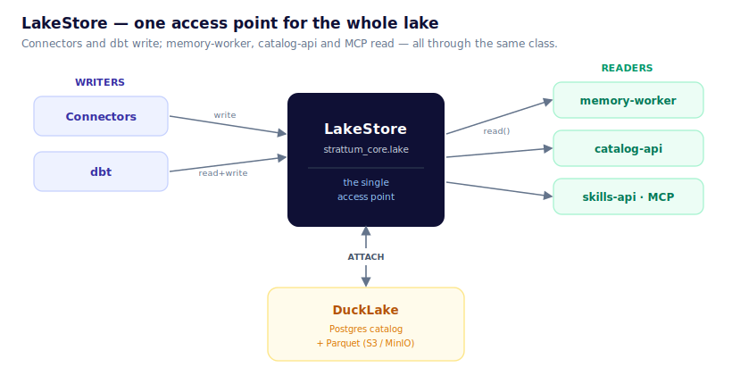
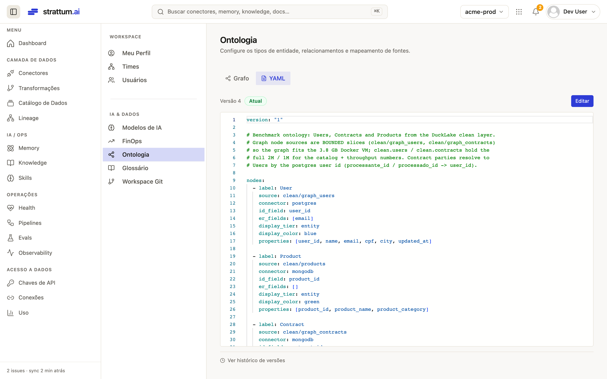

# Architecture — Strattum Lakehouse (open lake)

> 🇧🇷 Versão em português: [ARQUITETURA-LAKEHOUSE.md](ARQUITETURA-LAKEHOUSE.md)

**Status:** current (reference for the production architecture) · **Scope:** how data
comes in (connectors), becomes tables (lake), gets modeled (dbt clean) and becomes a
graph (memory-worker).

Three-line summary: each **connector** pulls data from a source and writes to the lake's
**`raw`**; **dbt** transforms `raw → clean`; the **memory-worker** reads `clean` and
builds the **graph**. The lake is **DuckLake** (Postgres catalog + Parquet on MinIO/S3),
accessed through a single point: **`LakeStore`**.



---

## Mental model (read this first)

The lake has **five boxes** and **one destination**:

> **SOURCE → RAW → (ENRICHMENT) → CLEAN → GRAPH** — and everything is **served over SQL
> and over MCP**.

- **RAW** — the data as it came from the source, in **Parquet** in the lake (one table
  per resource).
- **CLEAN** — the **modeled** data (typed, deduplicated, with `external_id`). It is what
  the UI and the graph consume.
- **GRAPH** — entities and relationships in **FalkorDB**, built from CLEAN through an
  **ontology**.

**Two entry paths** — the only fork that matters:

| Path | When | What Strattum does |
|---|---|---|
| **With ETL** | customer **without** a data lake | runs the pipeline: connector pulls → `RAW` → dbt → `CLEAN` |
| **No ETL (federation)** | customer **with** a lake/warehouse (Snowflake, BigQuery, …) | **no copying** — DuckDB + ADBC reads the data *in place* and feeds the graph directly (roadmap) |

The two paths converge on the **same graph** and are served by the **same**
`run_sql`/MCP. The rest of this document details the **with-ETL** path (what runs in
production today); federation is in [§7](#7-the-3-reference-archetypes) and in ADR-020.

> **Where to touch the code:** new connector → `services/pipelines/src/connectors/<c>/`
> + `flows/<c>_sync.py` · modeling → `dbt/models/clean/` · graph ontology →
> `graph_mapping.yaml`. Lake access is **always** via `strattum_core.lake.LakeStore` —
> never hand-written lake SQL.

---

## The LakeStore — the heart of the lake

Before, each service opened the lake its own way (shared `.duckdb`, `write_delta`,
Parquet globs). Today **everything goes through a single class** —
`strattum_core.lake.LakeStore`. Connectors **write**, dbt reads and writes,
memory-worker / catalog-api / skills-api / MCP **read** — all through here. It is the
only place that knows the lake is DuckLake.



**How it opens the lake** (on every connection): an in-memory, stateless DuckDB (there
is no `.duckdb` file anymore) that **(1)** loads the `ducklake`+`httpfs`+`postgres`
extensions, **(2)** creates the S3 secret (MinIO/AWS/R2 — only the `ENDPOINT` changes)
and **(3)** runs `ATTACH 'ducklake:postgres:<dsn>' AS lake (DATA_PATH 's3://…')`. Done:
`lake.raw.<t>`, `lake.clean.<t>` resolve. Because the **catalog is Postgres**, many
processes write at the same time (snapshot isolation) — that is what killed the
single-writer lock.

**The whole API** (small on purpose):

| Write | Read | Utility |
|---|---|---|
| `write(layer, table, data, mode, pk)` | `read("<layer>/<table>", watermark=…)` → `dict`s | `list_tables` · `table_exists` · `get_columns` |
| `write_records_batched(...)` — streaming in 10k batches (never holds the whole resource in RAM) | `connection()` — escape hatch for custom SQL (catalog-api, skills-api) | `delete_where_in` (chunked) · `bootstrap` |

- **`mode`** = `overwrite` (default) · `append` · `merge` (upsert by `primary_key`).
  DuckLake has no PK/UNIQUE → merge is *delete-then-insert*; schema drift is tolerated
  (`INSERT ... BY NAME`).
- **`read()` is origin-agnostic** — it returns `dict`s whether the source is our `clean`
  or (future) a federated warehouse via ADBC. The memory-worker receives the same thing
  → **the graph path never changes**.
- **Swapping formats** (DuckLake → Delta) = reimplementing this class; callers do not
  change.
- **`attach_federation()`** is the federation hook (task 03): since `read()` is already
  agnostic, the customer's lake/warehouse enters through the **same** reader — it is the
  bridge to the "no ETL" path in the diagram above.

---

## 1. The lake (DuckLake)

An **open** lakehouse: the **catalog** (schema, snapshots, file map) lives in
**Postgres**; the **data** is **Parquet** on **S3/MinIO**. DuckDB is just the engine
(embedded). Three layers, addressed as `lake.<layer>.<table>`:

- **`raw`** — the data as it came from the source, one table per resource
  (`raw."<connector>__<resource>"`).
- **`enrichment`** — AI columns (optional, additive).
- **`clean`** — the modeled layer (typed, `external_id`) that the graph and the UI
  consume.

## 2. How a connector brings data in

- **`StratumConnector` interface:** `authenticate` · `discover` · `extract(resource,
  state, *, limit)` · `test_connection`. `extract` **streams** (paginates / `fetchmany`
  / `yield` in a loop) — **never** `.fetchall()`; the resource never fits in RAM.
- **Incremental — one engine:** `sync_resource_to_raw`
  (`connectors/utils/resource_config.py`) reads the resource config from
  **`connector_state`** and decides: **incremental** → `cursor > last_value`, **MERGE by
  PK**, advances the watermark · **full_refresh** (safe default) → pulls everything and
  overwrites.
- **PK and cursor:** SaaS = a fixed fact of the API; databases = the user picks in the
  UI (stored in `connector_state`). The flow reads them with
  `get_resource_configs("<c>")`.
- **Consolidated tables** (`notion__pages`, `slack__messages`, …) — N sub-resources in a
  single table → **always `merge`**, never `overwrite` (or you erase the siblings).

## 3. The flow (single pattern)

Every `flows/<c>_sync.py` has the same shape (ref: `asaas_sync.py`,
`bigquery_sync.py`) — only the extraction core changes:

```
load_<c>_credentials → load_<c>_config → _build_connector(creds)
  → discover (ONE test_connection) → extract_<c>_resource (per resource, honors the mode)
  → run_<c>_dbt → thin @flow
```

The `@flow` name = the file name (`deploy.py` discovers by glob). Every flow carries
`@with_sync_progress` (writes `running/completed/failed` to `connector_sync_progress`).

## 4. `raw → clean` (dbt) and enrichment

- **dbt clean** reads `lake.raw."<c>__..."`. `run_dbt_for_connector("<c>")`
  **auto-discovers** the models that depend on the connector and runs only those (skips
  0-row ones). In-process (`dbtRunner`).
- **Concurrency (advisory lock):** a *cross-source* model (e.g. `clean.customers` fed by
  postgres **and** mongodb) is discovered by both flows and would collide on the
  DuckLake commit. `_run_dbt` **serializes per model** with a Postgres advisory lock
  (`connectors/utils/locks.py`): 1 run per model at a time, fail-open, kill-switch
  `DBT_LOCK_DISABLED`. Detail in [exp 09](experimentacoes/09-ducklake-concorrencia/).
- **ACL:** every clean model carries `acl_allow`/`acl_deny` (macro
  `strattum_acl_columns()` — ADR-019). Permissions are **extracted per object from both
  paths** (with-ETL **and** federated sources) by a Prefect task and written to
  `auth.access_grant` — **in the same Postgres as the catalog**; a recurring process
  **applies** the columns onto clean on every sync.
- **Databases:** clean generated at runtime (catalog-api synthesizes the SELECT:
  PK→`external_id`, PII `drop`/`hash`).
- **Enrichment (optional):** with AI transforms it runs `raw → enrichment → clean`;
  otherwise `raw → clean` directly.

## 5. `clean → graph`

Only for connectors with an **`ontology_fragment.yaml`** (the fixed-schema SaaS ones).
The fragment declares nodes/edges/timeline/ER; it is merged into `graph_mapping.yaml`;
the **memory-worker** reads `lake.clean` (via `LakeStore.read`), mints `entity_id`
(deterministic entity resolution — the same key, e.g. an email, becomes the same id
across runs, unifying sources), generates Cypher (MERGE) and writes to **FalkorDB**
(graph `strattum_memory`). Dynamic-schema connectors (airtable + databases) have **no**
fragment — the FDE maps per customer post-onboarding.

**How `graph_mapping.yaml` gets created** — two ways, same versioned result:

- **Fixed-schema connector** → the `ontology_fragment.yaml` ships with the connector;
  the FDE reviews it and merges it into the unified `graph_mapping.yaml`.
- **Dynamic-schema (databases, warehouse, airtable)** → there is no factory fragment;
  the map is **written per customer**:
  - **Via the API** (FDE / automation): `PUT /v1/ontology` (saves a version) + `POST
    /v1/ontology/apply` (applies; optional `reset=true` to clear ghost entities from old
    ontologies — ADR-008).
  - **Via the UI** (the customer): **Settings → Ontology**. The **Graph** tab shows the
    map as a diagram; the **YAML** tab is the editor (Monaco) — **Edit → (validates the
    YAML *and* the columns against the real `clean` tables) → Save and apply**,
    versioned with history and rollback.



> In the [benchmark](BENCHMARK-LAKEHOUSE.en.md) the `User`/`Contract`/`Product` ontology
> was created exactly through this path (via the API, registered as **Version 4**) — the
> screenshot above is that ontology, open in a customer's UI.

---

## 6. Connector summary

**Incremental legend:** ✅ working (flow passes the state, merge by PK, watermark
advances) · 🔸 CDC/webhook · ⚠️ caveat (see note).
**Graph legend:** ✅ ships an `ontology_fragment.yaml` (graph map ready **out of the
box**) · ✍️ the **FDE** writes the ontology **per customer** (the schema belongs to the
customer — a fixed map cannot be shipped).

| Connector | Type | How it extracts (streaming) | Incremental | Graph |
|---|---|---|---|---|
| **asaas** | fixed SaaS | REST offset/limit + `hasMore` | ✅ cursor `dateCreated`/`transferDate` | ✅ |
| **bigquery** | warehouse | SQL `fetchmany(1000)`; *federation is the future* | ✅ cursor via `connector_state` | ✍️ FDE |
| **postgres** | database | SQL `stream_results`+`fetchmany` | ✅ cursor via `connector_state` | ✍️ FDE |
| **mysql** | database | SQL `stream_results`+`fetchmany` | ✅ cursor via `connector_state` | ✍️ FDE |
| **mongodb** | database | cursor `.batch_size` | ✅ `cursor_field` via `connector_state` | ✍️ FDE |
| **airtable** | dynamic | REST + **webhook CDC** | 🔸 webhook (`changed_record_ids`) + delete | ✍️ FDE |
| **salesforce** | fixed SaaS | SOQL `query_all_iter` (streaming) | ✅ `LastModifiedDate`, PK `Id` | ✅ |
| **hubspot** | fixed SaaS | REST paging (associations in batches) | ✅ `hs_lastmodifieddate` | ✅ |
| **jira** | fixed SaaS | REST `nextPageToken` | ✅ `updated` (+ walk-cursor for links/comments) | ✅ |
| **zendesk** | fixed SaaS | REST incremental exports (cursor) | ✅ `updated_at` (→ `start_time`) | ✅ |
| **slack** | fixed SaaS | REST cursor paging | ✅ `ts`, PK `channel:ts` | ✅ |
| **clickup** | fixed SaaS | REST page paging | ✅ `date_updated` (tasks) | ✅ |
| **confluence** | fixed SaaS | REST start/limit | ✅ `version_when` (merge per space) | ✅ |
| **notion** | dynamic | REST `start_cursor` | ✅ `last_edited_time` (merge per database) | ✅ |
| **google_analytics** | fixed SaaS | `run_report` **paginated** | ✅ `date` (MERGE-by-day) | ✅ (`nodes: []`) |
| **microsoft365** | SaaS/files | per-drive streaming (`@odata.nextLink`) | ✅ per-drive cursor, merge `doc_id` | ✅ |
| **google_drive** | SaaS/files | streaming listing + content | ⚠️ `modified_at` wired, but the **watermark does not persist** (pre-existing bug — §8) | ✅ |

> ### ⚠️ The `✍️ FDE` in the Graph column does **not** mean "does not reach the graph"
>
> Every connector **can** feed the graph. The difference is **who writes the map** (the
> ontology linking `clean` → nodes/edges):
>
> - **Fixed schema (SaaS)** — the connector already **knows** its entities (a HubSpot
>   "deal" is always a deal), so it **ships** a factory `ontology_fragment.yaml` → graph
>   **out of the box** (✅).
> - **Dynamic schema (databases `postgres`/`mysql`/`mongodb`, warehouse, `airtable`)** —
>   the schema is **defined by the customer**; Strattum cannot know in advance which
>   tables/columns exist, so shipping a fixed map is **impossible**. There, the **FDE
>   writes the ontology per customer**, after onboarding, looking at real data (✍️).
>
> **Living proof — this is exactly the benchmark's case.** The
> [LAKEHOUSE BENCHMARK](BENCHMARK-LAKEHOUSE.en.md) runs **`postgres` + `mongodb`** (both
> `✍️`) **all the way to the graph** — 290k nodes, 300k edges — precisely because the
> *bespoke* ontology (`graph_mapping.yaml`: `User`/`Contract`/`Product` nodes +
> `PROCESSANTE`/`PROCESSADO`/`SOBRE` edges) was hand-written for that customer. The `✍️`
> is **exactly that step** — not a limitation.

**How each one is organized** — every connector has the same layout: `auth.py` ·
`config.py` · `connector.py` · `schemas/` · `transforms/` (+ `transforms.yaml`) ·
`acl.py` · `ontology_fragment.yaml` + `knowledge_fragment.yaml` (fixed-schema only) ·
`tests/`. Databases omit transforms/fragments (the schema belongs to the customer,
generated at runtime; the ontology comes from the FDE).

### 6.1 Merge keys (PK) and cursors

In DuckLake **there is no PRIMARY KEY** — the "merge" is *delete-then-insert* by the key
below. The **PK** identifies the row (the upsert deletes the key and reinserts in place,
keeping `raw` as a deduplicated snapshot); the **cursor** is the date column the
incremental compares (`cursor > last_value`) and persists as the watermark. Where the
two come from:

- **Fixed-schema SaaS** — PK and cursor are a **fact of the API**, constants in the
  connector's `config.py`/`schemas/`; the user does **not** choose.
- **Databases and warehouse** (`postgres`, `mysql`, `bigquery`, `mongodb`) — PK and
  cursor are **chosen by the user per table** in the UI (column picker) and stored in
  `connector_state.__config.resources`. MongoDB assumes `_id` as the default.
- **Synthetic** — `slack` composes `message_key = channel_id:ts` (`ts` alone is not
  unique across channels); `airtable` uses the API's own `record_id`.

| Connector | PK (merge key) | Cursor (incremental) | PK origin |
|---|---|---|---|
| **asaas** | `id` | `dateCreated` · `transferDate` (transfers) | API const |
| **salesforce** | `Id` | `LastModifiedDate` | API const |
| **hubspot** | `id` | `hs_lastmodifieddate` | API const |
| **jira** | `id` (users: `account_id`) | `updated` (+ walk `issue_updated`) | per-resource dict |
| **zendesk** | `id` | `updated_at` | API const |
| **clickup** | `id` | `date_updated` (tasks) | API const |
| **confluence** | `id` | `version_when` | API const |
| **notion** | `id` | `last_edited_time` | API const |
| **slack** | `message_key` (`=channel_id:ts`) | `ts` | synthetic |
| **google_analytics** | `date` | `date` | API const |
| **microsoft365** | `doc_id` | `modified_at` | const |
| **google_drive** | `doc_id` ¹ | `modified_at` ¹ | const |
| **airtable** | `record_id` (comments: `comment_id`) | CDC webhook (`changed_record_ids`) | API const |
| **postgres** | chosen in the UI | chosen in the UI | `connector_state` |
| **mysql** | chosen in the UI | chosen in the UI | `connector_state` |
| **bigquery** | chosen in the UI | chosen in the UI | `connector_state` |
| **mongodb** | `_id` (default) | chosen in the UI (`cursor_field`) | `connector_state` |

¹ `google_drive`: PK/cursor wired, but the watermark **does not persist** today (§8) →
effectively full on every run.

**Resources that are always full** (never incremental — `supports_incremental=False`,
the flow forces `full_refresh` regardless of what the UI asks): `asaas` `subscriptions`;
`clickup` `members`/`lists`/`spaces`; `hubspot` `*_associations` (composite pair
`(from_id,to_id)` with no single-column PK, and a merge would not detect a *removed*
association); `jira` `projects`/`users` and comments; `zendesk` comments.

**Consolidated tables — always `merge`, never `overwrite`** (N sub-resources written
into a single table; `overwrite` would erase the siblings): `notion__pages` (merge per
database), `confluence__pages` (merge per space), `slack__messages` (merge per channel).

### 6.2 What each connector needs (credentials)

Fields read in each connector's `authenticate()` — what the customer fills in the config
modal for the connection to work:

| Connector | Credentials / minimum config |
|---|---|
| **asaas** | `api_key` + `environment` (sandbox/production) |
| **salesforce** | `username`, `password`, `security_token`, `client_id`, `client_secret` |
| **hubspot** | `access_token` (Private App) |
| **jira** | `domain`, `email`, `api_token` (+ optional `custom_field_ids`) |
| **zendesk** | `subdomain`, `email`, `api_token` |
| **clickup** | `api_key` + `team_id` |
| **confluence** | `domain`, `email`, `api_token` (+ `space_keys`) |
| **notion** | `token` (integration) + `database_ids` |
| **slack** | `bot_token` + `channel_ids` |
| **google_analytics** | `service_account_json` + `property_id` |
| **microsoft365** | `tenant_id`, `client_id`, `client_secret` (+ `selected_drives`/`selected_sites`) |
| **google_drive** | `service_account_json` + `folder_ids`/`file_ids` (+ `subject_email` for domain-wide) |
| **airtable** | `AIRTABLE_PAT` + `AIRTABLE_CONFIG` (selected bases/tables) |
| **postgres** / **mysql** | `connection_string` |
| **bigquery** | `project_id` + `service_account_info` |
| **mongodb** | `uri` |

## 7. The 3 reference archetypes

- **`airtable`** — dynamic-schema / **CDC**: user-selectable strategy, webhook,
  `delete_where_in`, opaque raw (`fields_json`), no ontology.
- **`asaas`** — **fixed-schema SaaS / cursor**: incremental via `connector_state`,
  cursor from the `ResourceSchema`, has an ontology.
- **`bigquery`** — **warehouse**: streaming via `fetchmany`, cursor via
  `connector_state`; the future target is **federation** (see
  `../strattum-brain/docs/adr/020-bigquery-federation-vs-etl.md`).

## 8. Known follow-ups (post-reform)

All 17 connectors were brought to the standard (real incremental, streaming, uniform
flow shape, connector+flow+E2E tests). What remains:

1. **Per-resource sync-mode UI** — done for **5** (airtable, asaas, clickup, hubspot,
   zendesk). **6** SaaS remain (salesforce, google_analytics, jira, slack, confluence,
   notion): `resource-config` route in catalog-api + switches in the modal + i18n
   (pattern already reproduced, just replicate). `microsoft365`/`google_drive` have no
   toggle (1 resource / selection via YAML).
2. **`google_drive` watermark** — `extract_google_drive_source` calls
   `conn_logger.finish(new_state=None)`, so the `modified_at` cursor never persists →
   re-scan on every run. Needs to track the max and persist via `new_state`.
3. **catalog-api `_install_shipped_transforms`** — the `_DOC_CONNECTOR_TYPES` gate needs
   to include the SaaS connectors that now ship clean SQL (e.g. google_analytics gained
   transforms).
4. **E2E test hygiene** — some E2E pytest tests monkeypatch `get_lake`/`_attach_sql` at
   module level without restoring → 1 flake under combined execution (passes in
   isolation). Restore via fixture.
5. **FDE reviews (ontology_fragment)** — agent flags: `salesforce`
   (`HAS_DEAL`/`OPENED_CASE` join_key on the wrong node), `slack` (`Agent` node without
   a role filter, edges without `source:`), `clickup` (`TaskList`/`Space` nodes without
   a transform).
6. **Pre-existing bugs found (not introduced)** — `mysql` (mismatch
   `MYSQL_CLIENT_URL`≠`connection_string` in auth), `confluence` (the modal's `spaces`
   dropped by `SaveConnectorRequest` → selection never persists), `hubspot`
   (`test_connection` raises instead of returning `False`). The dead `QUALIFY ...
   _dlt_load_id` in the clean SQL (jira/notion/confluence) **was already fixed** in the
   reform.

> Standardized per-connector reform: `/reform-connector <name>` (`.claude/commands/`).

---

## 9. Live E2E validation (DuckLake migration) — 2026-07-19

Closing the migration to the **open lake**: run the real stack end to end and prove that
data from **two distinct sources** lands in a **single clean table**, with real
incremental and Parquet on MinIO. Not a simulated test — it is the local production
stack (Postgres catalog + MinIO + Prefect worker + console UI).

**Setup:** two connectors created **through the UI** (`postgres`, `mongodb`), each with
4 `customers` at the source. Scheduled sync (hourly cron) + manual triggers.

**Proven flow (end to end):** UI → connector → sync → `raw` (Parquet on MinIO, both
sources) → dbt auto-discovery → unified `lake.clean.customers` → **FalkorDB graph**
(memory-worker) → read via **MCP `run_sql`**.

**Before → after:**

| Signal | Before (pre-migration) | After (measured) |
|---|---|---|
| Storage | shared `.duckdb` / local delta files | **DuckLake**: Postgres catalog + Parquet on MinIO (`s3://strattum-lake`) |
| `raw` | per-connector, engine-coupled | `raw.postgres__public__customers` = **4**, `raw.mongodb__demo__customers` = **4** |
| Unified `clean` | nonexistent (1 source per table) | `clean.customers` = **8** (`postgres=4 + mongodb=4`), email `LOWER/TRIM`, per-source `external_id` |
| Incremental | full on every run | **MERGE by PK**: Ana's email update (`ana@` → `ana.nova@`) landed **without duplicating** (1 row); mongo picked Gustavo up as the delta (3→4) |
| Watermark | — | advances and persists in `connector_state` (postgres `2026-07-05`, mongo `2026-07-04`) |
| Concurrent writes | single-writer (file lock) | 2 connectors write to the same lake at the same time (Postgres catalog) |

**`clean → graph` (memory-worker):** a minimal ontology authored for `clean.customers`
(dynamic-schema ships no fragment — the FDE maps per customer): `Customer` node,
`source: clean/customers`, **`id_field: email`** + `er_fields: [email]` (the ER key
**is** the email, with no source namespace → two rows with the same email collapse into
a single node across sources). Ran the pipeline directly → **8 `Customer` nodes** in
FalkorDB (`strattum_memory`), deterministic `entity_id` = `uuid5(email)`, `errors: []`.
(The demo's 8 emails are distinct, so there is no collapse to demonstrate in this
dataset — the ER is wired; it just needs a shared email to display the unification.)

**`graph → read` (MCP `run_sql`):** proved the path **MCP `run_sql` → skills-api
`/v1/skills/sql` → `LakeStore` → DuckLake**: a `SELECT` over `lake.clean.customers`
returns the 8 unified customers (markdown, 500-row cap);
`DELETE`/`UPDATE`/`DROP`/`read_parquet(glob)` **blocked** (`400`). skills-api came up
host-side with the same auth bypass as catalog-api.

**Bugs found in the E2E → fixed:**
1. **Concurrent dbt (same model):** two syncs on the same tick auto-discover
   `clean.customers` and collide on the DuckLake commit — reproduced live (the 01:00 run
   failed postgres's dbt with `Failed to commit DuckLake transaction`, recovering only
   on retry). **Fix:** per-model advisory lock (§4) + concurrency ceiling of 1 on the
   Prefect work pool (`STRATTUM_DATA_WORK_POOL_CONCURRENCY`, converged in
   `flows.deploy`). **Live re-test:** 2 syncs at the same instant → postgres locked and
   materialized, mongo **blocked for 1.6s** and ran after the release — **0 collisions,
   0 retries**. Coverage: `connectors/utils/tests/test_locks.py` (11 tests).
2. **memory-worker × typed timestamp:** a `TIMESTAMPTZ` column from clean comes back
   from DuckDB as `datetime`, and FalkorDB's parameter serializer inlines it as a raw
   literal (`Invalid input '-'`) → **all** nodes in a batch fail (affects any clean with
   a date column). **Fix:** parameter sanitization in
   `memory_worker/falkordb_client.py` (`datetime/date/Decimal/UUID/bytes → primitive`)
   at the single `execute`/`execute_batch` entry point. Coverage:
   `tests/test_falkordb_params.py` (9 tests).

**E2E follow-ups** (outside the migration's own scope): demonstrate the ER collapse with
an email shared across sources; the *incremental clean layer* toggle in the UI is still
a no-op; mongo's string cursor has a type edge (BSON `$gt`) to harden — the last two
already tracked as their own tasks.
