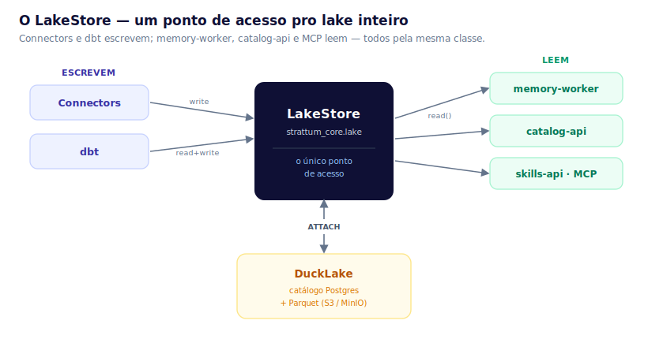

# Arquitetura — Strattum Lakehouse (lake aberto)

> 🇬🇧 English version: [ARQUITETURA-LAKEHOUSE.en.md](ARQUITETURA-LAKEHOUSE.en.md)

**Status:** vigente (referência da arquitetura em produção) · **Escopo:** como os dados entram (connectors), viram tabelas (lake), são modelados (dbt clean) e viram grafo (memory-worker).

Resumo em 3 linhas: cada **connector** puxa dados de uma fonte e grava na **`raw`** do lake; o **dbt** transforma `raw → clean`; o **memory-worker** lê a `clean` e monta o **grafo**. O lake é **DuckLake** (catálogo em Postgres + Parquet em MinIO/S3), acessado por um único ponto: **`LakeStore`**.


---

## Modelo mental (leia isto primeiro)

O lake tem **cinco caixas** e **um só destino**:

> **FONTE → RAW → (ENRICHMENT) → CLEAN → GRAFO** — e tudo é **servido por SQL e por MCP**.

- **RAW** — o dado como veio da fonte, em **Parquet** no lake (uma tabela por recurso).
- **CLEAN** — o dado **modelado** (tipado, deduplicado, com `external_id`). É o que a UI e o grafo consomem.
- **GRAFO** — entidades e relações no **FalkorDB**, montadas a partir da CLEAN por uma **ontologia**.

**Dois caminhos de entrada** — é a única bifurcação que importa:

| Caminho | Quando | O que a Strattum faz |
|---|---|---|
| **Com ETL** | cliente **sem** data lake | roda o pipeline: connector puxa → `RAW` → dbt → `CLEAN` |
| **Sem ETL (federação)** | cliente **com** lake/warehouse (Snowflake, BigQuery, …) | **não copia** — DuckDB + ADBC lê os dados *in-place* e alimenta o grafo direto (roadmap) |

Os dois caminhos convergem no **mesmo grafo** e são servidos pelo **mesmo** `run_sql`/MCP. O resto deste documento detalha o caminho **com ETL** (o que roda em produção hoje); a federação está na [§7](#7-os-3-arquétipos-de-referência) e no ADR-020.

> **Feature possível — clean híbrida:** um model `clean` vai poder **juntar** dado
> federado (ADBC) com `raw`/`enrichment` do lake no mesmo `JOIN`. Nesse caso — e só
> nesse — o resultado **é materializado no lake** (o dado federado passa a ser guardado
> no banco): abre-se mão do zero-cópia nesse model em troca do cruzamento das fontes.

> **Onde mexer no código:** conector novo → `services/pipelines/src/connectors/<c>/` + `flows/<c>_sync.py` · modelagem → `dbt/models/clean/` · ontologia do grafo → `graph_mapping.yaml`. O acesso ao lake é **sempre** via `strattum_core.lake.LakeStore` — nunca SQL de lake na mão.

---

## O LakeStore — o coração do lake

Antes, cada serviço abria o lake do seu jeito (`.duckdb` compartilhado, `write_delta`, globs de Parquet). Hoje **tudo passa por uma classe só** — `strattum_core.lake.LakeStore`. Connector **escreve**, dbt lê e escreve, memory-worker / catalog-api / skills-api / MCP **leem** — todos por aqui. É o único lugar que sabe que o lake é DuckLake.



**Como ele abre o lake** (a cada conexão): um DuckDB **em memória, sem estado** (não existe mais arquivo `.duckdb`) que **(1)** carrega as extensões `ducklake`+`httpfs`+`postgres`, **(2)** cria o secret S3 (MinIO/AWS/R2 — muda só o `ENDPOINT`) e **(3)** faz `ATTACH 'ducklake:postgres:<dsn>' AS lake (DATA_PATH 's3://…')`. Pronto: `lake.raw.<t>`, `lake.clean.<t>` resolvem. Como o **catálogo é Postgres**, vários processos escrevem ao mesmo tempo (isolamento por snapshot) — foi isso que matou o lock de escritor único.

**A API inteira** (pequena de propósito):

| Escrever | Ler | Utilitário |
|---|---|---|
| `write(layer, table, data, mode, pk)` | `read("<layer>/<table>", watermark=…)` → `dict`s | `list_tables` · `table_exists` · `get_columns` |
| `write_records_batched(...)` — streaming em lotes de 10k (nunca segura o recurso todo em RAM) | `connection()` — escape hatch p/ SQL próprio (catalog-api, skills-api) | `delete_where_in` (chunked) · `bootstrap` |

- **`mode`** = `overwrite` (default) · `append` · `merge` (upsert por `primary_key`). DuckLake não tem PK/UNIQUE → merge é *delete-then-insert*; schema drift é tolerado (`INSERT ... BY NAME`).
- **`read()` é origin-agnostic** — devolve `dict`s venha da nossa `clean` ou (futuro) de um warehouse federado via ADBC. O memory-worker recebe a mesma coisa → **o caminho do grafo nunca muda**.
- **Trocar de formato** (DuckLake → Delta) = reimplementar essa classe; os chamadores não mudam.
- **`attach_federation()`** é o gancho da federação (tarefa 03): como o `read()` já é agnóstico, o lake/warehouse do cliente entra pelo **mesmo** leitor — é a ponte pro caminho "sem ETL" do diagrama lá em cima.

---

## 1. O lake (DuckLake)

Um lakehouse **aberto**: o **catálogo** (schema, snapshots, mapa de arquivos) vive no **Postgres**; os **dados** são **Parquet** em **S3/MinIO**. DuckDB é só o motor (embutido). Três camadas, endereçadas `lake.<camada>.<tabela>`:

- **`raw`** — o dado como veio da fonte, uma tabela por recurso (`raw."<connector>__<recurso>"`).
- **`enrichment`** — colunas de IA (opcional, aditivo).
- **`clean`** — camada modelada (tipada, `external_id`) que o grafo e a UI consomem.

## 2. Como um connector traz dados

- **Interface `StratumConnector`:** `authenticate` · `discover` · `extract(resource, state, *, limit)` · `test_connection`. O `extract` **faz streaming** (pagina / `fetchmany` / `yield` num loop) — **nunca** `.fetchall()`, o recurso jamais cabe todo na RAM.
- **Incremental — um motor só:** `sync_resource_to_raw` (`connectors/utils/resource_config.py`) lê a config do recurso no **`connector_state`** e decide: **incremental** → `cursor > last_value`, **MERGE por PK**, avança o watermark · **full_refresh** (default seguro) → puxa tudo e sobrescreve.
- **PK e cursor:** SaaS = fato fixo da API; bancos = o usuário escolhe na UI (gravado no `connector_state`). O flow lê com `get_resource_configs("<c>")`.
- **Tabelas consolidadas** (`notion__pages`, `slack__messages`, …) — N sub-recursos numa tabela só → **sempre `merge`**, nunca `overwrite` (senão apaga os irmãos).

## 3. O flow (padrão único)

Todo `flows/<c>_sync.py` tem a mesma forma (ref: `asaas_sync.py`, `bigquery_sync.py`) — muda só o miolo da extração:

```
load_<c>_credentials → load_<c>_config → _build_connector(creds)
  → discover (UM test_connection) → extract_<c>_resource (por recurso, honra o mode)
  → run_<c>_dbt → @flow fino
```

O nome do `@flow` = nome do arquivo (o `deploy.py` descobre por glob). Todo flow leva `@with_sync_progress` (grava `running/completed/failed` em `connector_sync_progress`).

## 4. `raw → clean` (dbt) e enrichment

- **dbt clean** lê `lake.raw."<c>__..."`. O `run_dbt_for_connector("<c>")` **auto-descobre** os models que dependem do connector e roda só eles (pula os de 0 linhas). In-process (`dbtRunner`).
- **Concorrência (advisory lock):** um model *cross-source* (ex. `clean.customers` de postgres **e** mongodb) é descoberto pelos dois flows e colidiria no commit do DuckLake. O `_run_dbt` **serializa por model** com um advisory lock do Postgres (`connectors/utils/locks.py`): 1 run por model por vez, fail-open, kill-switch `DBT_LOCK_DISABLED`. Detalhe no [exp 09](experimentacoes/09-ducklake-concorrencia/).
- **ACL:** todo model clean carrega `acl_allow`/`acl_deny` (macro `strattum_acl_columns()` — ADR-019). As permissões são **extraídas por objeto das duas vias** (fontes com ETL **e** federadas) por uma task Prefect e gravadas em `auth.access_grant` — **no mesmo Postgres do catálogo**; um processo recorrente **aplica** as colunas na clean a cada sync.
- **Bancos:** clean gerado em runtime (a catalog-api sintetiza o SELECT: PK→`external_id`, PII `drop`/`hash`).
- **Enrichment (opcional):** com AI transforms roda `raw → enrichment → clean`; senão `raw → clean` direto.

## 5. `clean → grafo`

Só para connectors com **`ontology_fragment.yaml`** (os SaaS de schema fixo). O fragment declara nós/arestas/timeline/ER; é mergeado no `graph_mapping.yaml`; o **memory-worker** lê a `lake.clean` (via `LakeStore.read`), minta `entity_id` (entity resolution determinística — a mesma chave, ex. um email, vira o mesmo id entre runs, unificando fontes), gera Cypher (MERGE) e escreve no **FalkorDB** (grafo `strattum_memory`). Connectors dynamic-schema (airtable + bancos) **não** têm fragment — o FDE mapeia por-cliente pós-onboarding.

**Como o `graph_mapping.yaml` é criado** — duas formas, mesmo resultado versionado:

- **Conector de schema fixo** → o `ontology_fragment.yaml` já vem no conector; o FDE revisa e mergeia no `graph_mapping.yaml` unificado.
- **Dynamic-schema (bancos, warehouse, airtable)** → não há fragment de fábrica; o mapa é **escrito por cliente**:
  - **Pela API** (FDE / automação): `PUT /v1/ontology` (salva versão) + `POST /v1/ontology/apply` (aplica; `reset=true` opcional pra limpar entidades-fantasma de ontologias antigas — ADR-008).
  - **Pela UI** (o próprio cliente): **Configurações → Ontologia**. A aba **Grafo** mostra o mapa como diagrama; a aba **YAML** é o editor (Monaco) — **Editar → (valida o YAML *e* as colunas contra as tabelas `clean` reais) → Salvar e aplicar**, versionado com histórico e rollback.


> No [benchmark](BENCHMARK-LAKEHOUSE.md) a ontologia `User`/`Contract`/`Product` foi criada exatamente por esse caminho (via API, registrada como **Versão 4**) — o print acima é ela, aberta na UI de um cliente.

---

## 6. Resumo dos conectores

**Legenda incremental:** ✅ funcionando (flow passa o state, merge por PK, watermark avança) · 🔸 CDC/webhook · ⚠️ ressalva (ver nota).
**Legenda grafo:** ✅ vem com `ontology_fragment.yaml` (mapa de grafo pronto **de fábrica**) · ✍️ **FDE** escreve a ontologia **por cliente** (o schema é do cliente — não dá pra shipar um mapa fixo).

| Conector | Tipo | Como extrai (streaming) | Incremental | Grafo |
|---|---|---|---|---|
| **asaas** | SaaS fixo | REST offset/limit + `hasMore` | ✅ cursor `dateCreated`/`transferDate` | ✅ |
| **bigquery** | warehouse | SQL `fetchmany(1000)`; *federation é o futuro* | ✅ cursor via `connector_state` | ✍️ FDE |
| **postgres** | banco | SQL `stream_results`+`fetchmany` | ✅ cursor via `connector_state` | ✍️ FDE |
| **mysql** | banco | SQL `stream_results`+`fetchmany` | ✅ cursor via `connector_state` | ✍️ FDE |
| **mongodb** | banco | cursor `.batch_size` | ✅ `cursor_field` via `connector_state` | ✍️ FDE |
| **airtable** | dynamic | REST + **webhook CDC** | 🔸 webhook (`changed_record_ids`) + delete | ✍️ FDE |
| **salesforce** | SaaS fixo | SOQL `query_all_iter` (streaming) | ✅ `LastModifiedDate`, PK `Id` | ✅ |
| **hubspot** | SaaS fixo | REST paging (associations em batches) | ✅ `hs_lastmodifieddate` | ✅ |
| **jira** | SaaS fixo | REST `nextPageToken` | ✅ `updated` (+ walk-cursor p/ links/comments) | ✅ |
| **zendesk** | SaaS fixo | REST incremental exports (cursor) | ✅ `updated_at` (→ `start_time`) | ✅ |
| **slack** | SaaS fixo | REST cursor paging | ✅ `ts`, PK `channel:ts` | ✅ |
| **clickup** | SaaS fixo | REST page paging | ✅ `date_updated` (tasks) | ✅ |
| **confluence** | SaaS fixo | REST start/limit | ✅ `version_when` (merge por space) | ✅ |
| **notion** | dynamic | REST `start_cursor` | ✅ `last_edited_time` (merge por database) | ✅ |
| **google_analytics** | SaaS fixo | `run_report` **paginado** | ✅ `date` (MERGE-by-dia) | ✅ (`nodes: []`) |
| **microsoft365** | SaaS/arquivos | streaming por drive (`@odata.nextLink`) | ✅ cursor por-drive, merge `doc_id` | ✅ |
| **google_drive** | SaaS/arquivos | lista streaming + conteúdo | ⚠️ `modified_at` wired, mas o **watermark não persiste** (bug pré-existente — §8) | ✅ |

> ### ⚠️ O `✍️ FDE` na coluna Grafo **não** quer dizer "não vai pro grafo"
>
> Todo conector **pode** alimentar o grafo. A diferença é **quem escreve o mapa** (a ontologia que liga `clean` → nós/arestas):
>
> - **Schema fixo (SaaS)** — o conector já **conhece** suas entidades (um "deal" do HubSpot é sempre um deal), então **shipa** um `ontology_fragment.yaml` de fábrica → grafo **out-of-the-box** (✅).
> - **Dynamic-schema (bancos `postgres`/`mysql`/`mongodb`, warehouse, `airtable`)** — o schema é **definido pelo cliente**; a Strattum não sabe de antemão que tabelas/colunas existem, então é **impossível** shipar um mapa fixo. Aí o **FDE escreve a ontologia por cliente**, depois do onboarding, olhando os dados reais (✍️).
>
> **Prova viva — é este o caso do benchmark.** O [BENCHMARK-LAKEHOUSE](BENCHMARK-LAKEHOUSE.md) roda **`postgres` + `mongodb`** (ambos `✍️`) **até o grafo** — 290k nós, 300k arestas — justamente porque a ontologia *bespoke* (`graph_mapping.yaml`: nós `User`/`Contract`/`Product` + arestas `PROCESSANTE`/`PROCESSADO`/`SOBRE`) foi escrita à mão pra aquele cliente. O `✍️` é **exatamente esse passo** — não uma limitação.

**Como cada um é organizado** — todo connector tem o mesmo layout: `auth.py` · `config.py` · `connector.py` · `schemas/` · `transforms/` (+ `transforms.yaml`) · `acl.py` · `ontology_fragment.yaml` + `knowledge_fragment.yaml` (só schema-fixo) · `tests/`. Bancos omitem transforms/fragments (schema é do cliente, gerado em runtime; a ontologia vem do FDE).

### 6.1 Chaves de merge (PK) e cursores

No DuckLake **não existe PRIMARY KEY** — o "merge" é *delete-then-insert* pela chave abaixo. A **PK** identifica a linha (o upsert apaga a chave e reinsere no lugar, mantendo a `raw` como snapshot deduplicado); o **cursor** é a coluna de data que o incremental compara (`cursor > last_value`) e persiste como watermark. De onde saem as duas:

- **SaaS de schema fixo** — PK e cursor são **fato da API**, constantes no `config.py`/`schemas/` do conector; o usuário **não** escolhe.
- **Bancos e warehouse** (`postgres`, `mysql`, `bigquery`, `mongodb`) — PK e cursor são **escolhidos pelo usuário por tabela** na UI (column picker) e gravados no `connector_state.__config.resources`. MongoDB assume `_id` como default.
- **Sintéticos** — `slack` compõe `message_key = channel_id:ts` (o `ts` sozinho não é único entre canais); `airtable` usa o `record_id` da própria API.

| Conector | PK (chave do merge) | Cursor (incremental) | Origem da PK |
|---|---|---|---|
| **asaas** | `id` | `dateCreated` · `transferDate` (transfers) | const API |
| **salesforce** | `Id` | `LastModifiedDate` | const API |
| **hubspot** | `id` | `hs_lastmodifieddate` | const API |
| **jira** | `id` (users: `account_id`) | `updated` (+ walk `issue_updated`) | dict por-recurso |
| **zendesk** | `id` | `updated_at` | const API |
| **clickup** | `id` | `date_updated` (tasks) | const API |
| **confluence** | `id` | `version_when` | const API |
| **notion** | `id` | `last_edited_time` | const API |
| **slack** | `message_key` (`=channel_id:ts`) | `ts` | sintético |
| **google_analytics** | `date` | `date` | const API |
| **microsoft365** | `doc_id` | `modified_at` | const |
| **google_drive** | `doc_id` ¹ | `modified_at` ¹ | const |
| **airtable** | `record_id` (comments: `comment_id`) | CDC webhook (`changed_record_ids`) | const API |
| **postgres** | escolhido na UI | escolhido na UI | `connector_state` |
| **mysql** | escolhido na UI | escolhido na UI | `connector_state` |
| **bigquery** | escolhido na UI | escolhido na UI | `connector_state` |
| **mongodb** | `_id` (default) | escolhido na UI (`cursor_field`) | `connector_state` |

¹ `google_drive`: PK/cursor cabeados, mas o watermark **não persiste** hoje (§8) → efetivamente full a cada run.

**Recursos que são sempre full** (nunca incremental — `supports_incremental=False`, o flow força `full_refresh`, independente do que a UI pedir): `asaas` `subscriptions`; `clickup` `members`/`lists`/`spaces`; `hubspot` `*_associations` (par composto `(from_id,to_id)` sem PK de coluna única, e um merge não detectaria a associação *removida*); `jira` `projects`/`users` e comentários; `zendesk` comentários.

**Tabelas consolidadas — sempre `merge`, nunca `overwrite`** (N sub-recursos gravados numa tabela só; `overwrite` apagaria os irmãos): `notion__pages` (merge por database), `confluence__pages` (merge por space), `slack__messages` (merge por canal).

### 6.2 O que cada conector precisa (credenciais)

Campos lidos no `authenticate()` de cada conector — o que o cliente informa no modal de config pra conexão funcionar:

| Conector | Credenciais / config mínima |
|---|---|
| **asaas** | `api_key` + `environment` (sandbox/produção) |
| **salesforce** | `username`, `password`, `security_token`, `client_id`, `client_secret` |
| **hubspot** | `access_token` (Private App) |
| **jira** | `domain`, `email`, `api_token` (+ `custom_field_ids` opcional) |
| **zendesk** | `subdomain`, `email`, `api_token` |
| **clickup** | `api_key` + `team_id` |
| **confluence** | `domain`, `email`, `api_token` (+ `space_keys`) |
| **notion** | `token` (integration) + `database_ids` |
| **slack** | `bot_token` + `channel_ids` |
| **google_analytics** | `service_account_json` + `property_id` |
| **microsoft365** | `tenant_id`, `client_id`, `client_secret` (+ `selected_drives`/`selected_sites`) |
| **google_drive** | `service_account_json` + `folder_ids`/`file_ids` (+ `subject_email` p/ domain-wide) |
| **airtable** | `AIRTABLE_PAT` + `AIRTABLE_CONFIG` (bases/tabelas selecionadas) |
| **postgres** / **mysql** | `connection_string` |
| **bigquery** | `project_id` + `service_account_info` |
| **mongodb** | `uri` |

## 7. Os 3 arquétipos de referência

- **`airtable`** — dynamic-schema / **CDC**: estratégia user-selecionável, webhook, `delete_where_in`, raw opaco (`fields_json`), sem ontology.
- **`asaas`** — SaaS de **schema fixo / cursor**: incremental por `connector_state`, cursor do `ResourceSchema`, tem ontology.
- **`bigquery`** — **warehouse**: streaming em `fetchmany`, cursor via `connector_state`; alvo futuro é **federation** (ver `../strattum-brain/docs/adr/020-bigquery-federation-vs-etl.md`).

## 8. Follow-ups conhecidos (pós-reforma)

Todos os 17 conectores foram levados ao padrão (incremental real, streaming, forma de flow uniforme, testes de conector+flow+E2E). O que resta:

1. **UI de sync-mode por-recurso** — feita em **5** (airtable, asaas, clickup, hubspot, zendesk). Faltam **6** SaaS (salesforce, google_analytics, jira, slack, confluence, notion): rota `resource-config` no catalog-api + switches no modal + i18n (padrão já reproduzido, só replicar). `microsoft365`/`google_drive` não têm toggle (1 recurso / seleção via YAML).
2. **`google_drive` watermark** — `extract_google_drive_source` chama `conn_logger.finish(new_state=None)`, então o cursor `modified_at` nunca persiste → re-scan a cada run. Precisa rastrear o max e persistir via `new_state`.
3. **catalog-api `_install_shipped_transforms`** — o gate `_DOC_CONNECTOR_TYPES` precisa incluir os SaaS que agora shippam clean SQL (ex. google_analytics ganhou transforms).
4. **Higiene de teste E2E** — alguns E2E-pytest fazem monkeypatch module-level de `get_lake`/`_attach_sql` sem restaurar → 1 flake sob execução combinada (passa isolado). Restaurar via fixture.
5. **Revisões FDE (ontology_fragment)** — flags dos agentes: `salesforce` (`HAS_DEAL`/`OPENED_CASE` join_key no nó errado), `slack` (nó `Agent` sem filtro de role, edges sem `source:`), `clickup` (nós `TaskList`/`Space` sem transform).
6. **Bugs pré-existentes achados (não introduzidos)** — `mysql` (mismatch `MYSQL_CLIENT_URL`≠`connection_string` no auth), `confluence` (`spaces` do modal descartado pelo `SaveConnectorRequest` → seleção nunca persiste), `hubspot` (`test_connection` levanta em vez de retornar `False`). O `QUALIFY ... _dlt_load_id` morto nas clean SQL (jira/notion/confluence) **já foi consertado** na reforma.

> Reforma padronizada por connector: `/reform-connector <nome>` (`.claude/commands/`).

---

## 9. Validação E2E ao vivo (migração DuckLake) — 2026-07-19

Fechamento da migração pro **lake aberto**: rodar a stack real de ponta a ponta e provar que dado de **duas fontes distintas** cai numa **única tabela clean**, com incremental de verdade e Parquet no MinIO. Não é sim de teste — é a stack de produção local (Postgres catálogo + MinIO + Prefect worker + console UI).

**Setup:** dois connectors criados **pela UI** (`postgres`, `mongodb`), cada um com 4 `customers` na fonte. Sync agendado (cron horário) + gatilhos manuais.

**Fluxo provado (ponta a ponta):** UI → connector → sync → `raw` (Parquet no MinIO, as 2 fontes) → dbt auto-discovery → `lake.clean.customers` unificado → **grafo FalkorDB** (memory-worker) → leitura via **MCP `run_sql`**.

**Antes → depois:**

| Sinal | Antes (pré-migração) | Depois (medido) |
|---|---|---|
| Storage | `.duckdb` compartilhado / delta files locais | **DuckLake**: catálogo Postgres + Parquet no MinIO (`s3://strattum-lake`) |
| `raw` | por-connector, acoplado à engine | `raw.postgres__public__customers` = **4**, `raw.mongodb__demo__customers` = **4** |
| `clean` unificado | inexistente (1 fonte por tabela) | `clean.customers` = **8** (`postgres=4 + mongodb=4`), email `LOWER/TRIM`, `external_id` por fonte |
| Incremental | full a cada run | **MERGE por PK**: update do email da Ana (`ana@` → `ana.nova@`) entrou **sem duplicar** (1 linha); mongo pegou o Gustavo como delta (3→4) |
| Watermark | — | avança e persiste no `connector_state` (postgres `2026-07-05`, mongo `2026-07-04`) |
| Escrita concorrente | single-writer (lock de arquivo) | 2 connectors escrevem no mesmo lake ao mesmo tempo (catálogo Postgres) |

**`clean → grafo` (memory-worker):** ontologia mínima autorada para a `clean.customers` (dynamic-schema não vem com fragment — o FDE mapeia por-cliente): nó `Customer`, `source: clean/customers`, **`id_field: email`** + `er_fields: [email]` (a chave de ER **é** o email, sem namespace de fonte → duas linhas com o mesmo email colapsam num nó só entre fontes). Rodado o pipeline direto → **8 nós `Customer`** no FalkorDB (`strattum_memory`), `entity_id` determinístico = `uuid5(email)`, `errors: []`. (Os 8 emails do demo são distintos, então não há colapso a demonstrar nesse dataset — a ER está cabeada, só falta um email compartilhado pra exibir a unificação.)

**`grafo → leitura` (MCP `run_sql`):** provado o caminho **MCP `run_sql` → skills-api `/v1/skills/sql` → `LakeStore` → DuckLake**: `SELECT` sobre `lake.clean.customers` retorna os 8 clientes unificados (markdown, cap 500 linhas); `DELETE`/`UPDATE`/`DROP`/`read_parquet(glob)` **bloqueados** (`400`). skills-api subiu host-side com o mesmo bypass de auth do catalog-api.

**Bugs achados no E2E → corrigidos:**
1. **dbt concorrente (mesmo model):** dois syncs no mesmo tick auto-descobrem `clean.customers` e colidem no commit do DuckLake — reproduzido ao vivo (o run das 01:00 falhou o dbt do postgres com `Failed to commit DuckLake transaction`, recuperou só no retry). **Fix:** advisory lock por model (§4) + teto de concorrência 1 no work-pool do Prefect (`STRATTUM_DATA_WORK_POOL_CONCURRENCY`, convergido em `flows.deploy`). **Re-teste ao vivo:** 2 syncs no mesmo instante → postgres travou e materializou, mongo **bloqueou 1,6s** e rodou após o release — **0 colisão, 0 retry**. Cobertura: `connectors/utils/tests/test_locks.py` (11 testes).
2. **memory-worker × timestamp tipado:** coluna `TIMESTAMPTZ` da clean volta do DuckDB como `datetime`, e o serializador de parâmetros do FalkorDB inlina como literal cru (`Invalid input '-'`) → **todos** os nós de um batch falham (afeta qualquer clean com coluna de data). **Fix:** sanitização de parâmetros em `memory_worker/falkordb_client.py` (`datetime/date/Decimal/UUID/bytes → primitivo`) no ponto único de `execute`/`execute_batch`. Cobertura: `tests/test_falkordb_params.py` (9 testes).

**Follow-ups do E2E** (fora do escopo da migração em si): demonstrar o colapso de ER com um email compartilhado entre fontes; o toggle *camada clean incremental* na UI ainda é no-op; o cursor string do mongo tem borda de tipo (BSON `$gt`) a endurecer — os dois últimos já rastreados como tarefas próprias.
