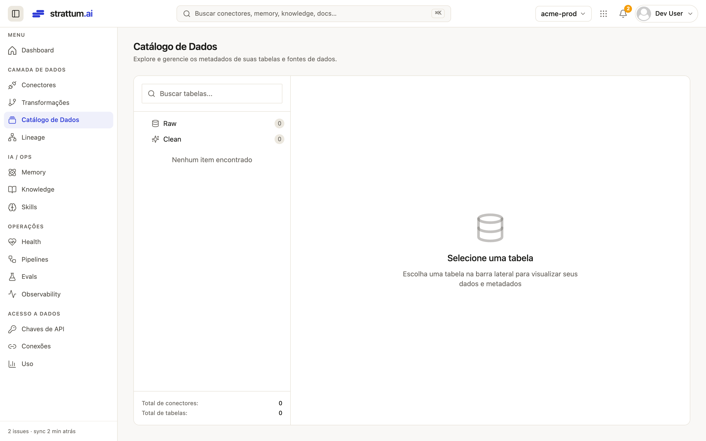
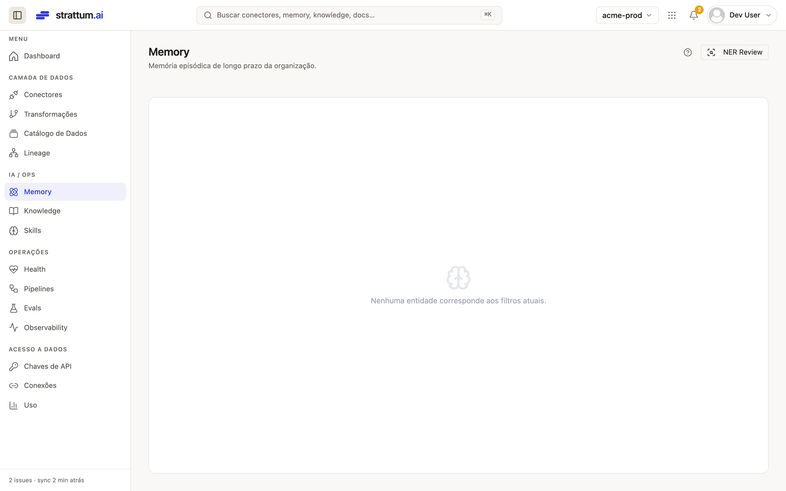
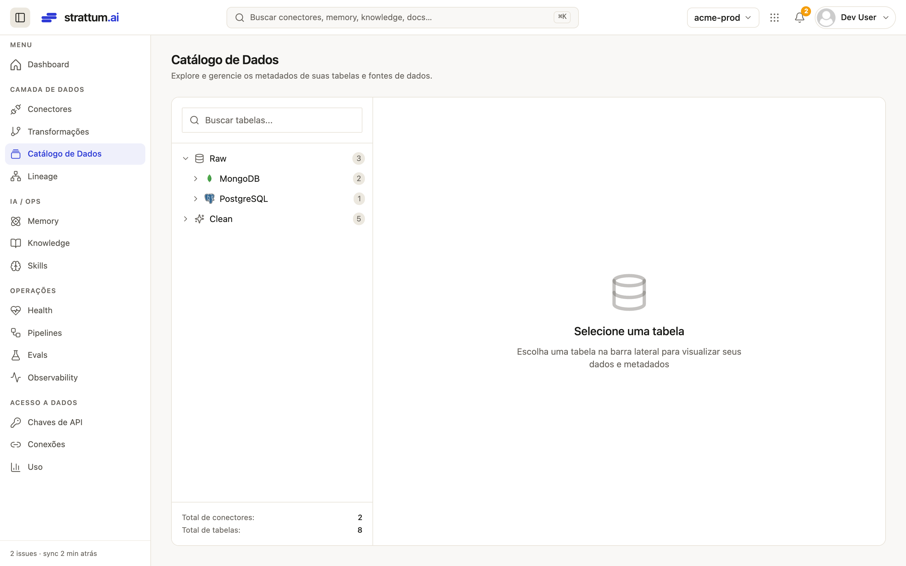
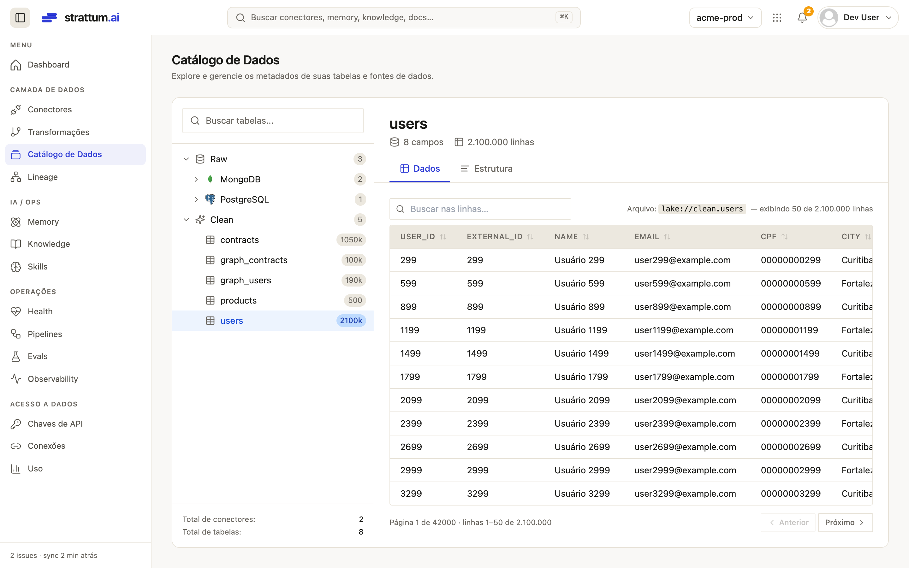
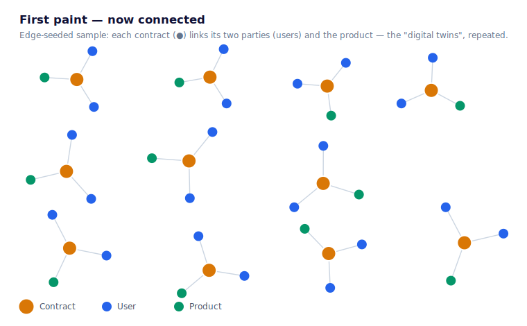
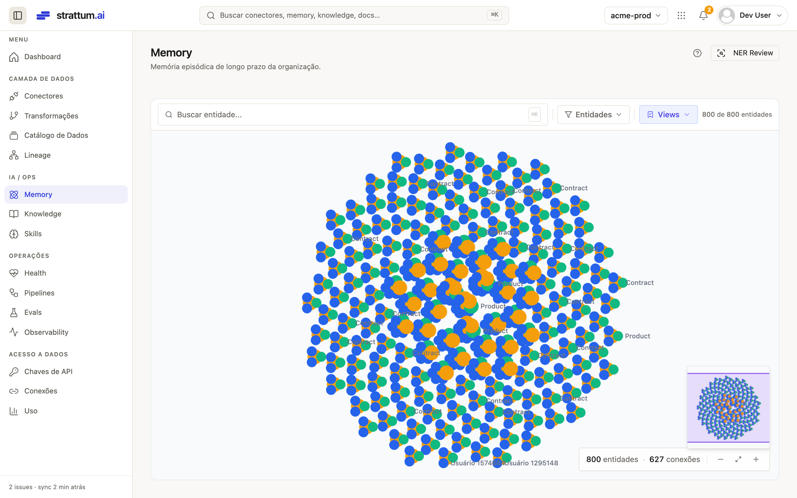

# Strattum — Open Lakehouse Benchmark

> 🇧🇷 Versão em português: [BENCHMARK-LAKEHOUSE.md](BENCHMARK-LAKEHOUSE.md)

> **From 2 operational databases to a knowledge graph, in minutes, on a laptop.**
> 3 million records (PostgreSQL + MongoDB) → open lakehouse (DuckLake + Parquet/S3)
> → modeled *clean* layer → entity graph — measured end to end.

This document reports a **reproducible** benchmark of the Strattum platform running
**entirely on a single MacBook (8 GB of RAM)**. The goal is to answer, with numbers, a
simple question: *how fast and how cheaply can any company turn its own operational
data into something useful?*

---

## TL;DR

| What | Volume | Time | Throughput | Peak RAM |
|---|---:|---:|---:|---:|
| **Ingestion** PostgreSQL → lake | 2,000,000 rows | **36.9 s** | ~54,200 rows/s | 272 MB |
| **Ingestion** MongoDB → lake | 1,000,500 docs | **25.0 s** | ~40,500 docs/s | 272 MB |
| **Transformation** (dbt/DuckLake) | 3,000,500 rows | **3.8 s** | ~795,000 rows/s | 382 MB |
| **Incremental sync** (+150k) | 150,000 rows | **3.5 s** | delta-only, 0 duplicates | 267 MB |
| **Knowledge graph** | 290,756 nodes · 300,000 edges | **126 s** ¹ | ~4,680 elem/s | 250 MB (worker) · 302 MB (FalkorDB) |

¹ Graph built on a **representative slice** (100k contracts + linked entities); build
optimized from 362 s → 126 s during the benchmark itself (see §4). Ingestion and *clean*
ran on the **full** volume.

**3 million rows ingested + modeled in ~66 seconds, peaking at ~380 MB of RAM per
process** — on desk hardware, over 100% open formats (Parquet + DuckLake catalog),
with no proprietary data warehouse and no cluster.

---

## The scenario

A typical mid-size company has its data scattered: a **PostgreSQL** with the people
registry, a **MongoDB** with contracts/cases, spreadsheets, an ERP. Nobody "does anything
with data" because pulling it all together normally takes a months-long project, an
expensive data warehouse and a dedicated team.

The benchmark simulates exactly that case with realistic synthetic data:

- **PostgreSQL — `users`**: 2,000,000 users (id, name, e-mail, national id, city, timestamps).
- **MongoDB — 2 collections**:
  - `contracts`: 1,000,000 contracts, each with **two parties** (`processante` and
    `processado`, both referencing a user) + product, status and value;
  - `products`: 500 products (id → name/category).
- **Increment**: +100,000 users and +50,000 contracts, to measure the cost of a
  next-day sync.

The target: a *clean* layer with **one users table** and **one contracts table**
(already `JOIN`ing the two Mongo collections to bring in the product name), and a
**graph** where each contract connects its two parties and its product.

---

## Setup (deliberately modest)

| Item | Value |
|---|---|
| Machine | MacBook, Apple Silicon, 8 vCPU, **8 GB RAM** |
| Docker (Linux VM) | **3.8 GB** for all containers |
| Sources | PostgreSQL 16, MongoDB 7 (containers) |
| Lakehouse | **DuckLake** (Postgres catalog) + **Parquet** on **MinIO** (S3) |
| Transformation | **dbt** running native **DuckDB/DuckLake** |
| Graph | **FalkorDB** (entity graph) |
| Orchestration | Prefect |

Nothing here is "benchmark hardware". It is what any dev has on their desk. That is
precisely the point: **the open architecture scales down** — it runs on a laptop today
and on a cluster tomorrow, without switching formats.

---

## Results by stage

### 1) Ingestion (bootstrap — full load)

Each connector **streams** from the source (server-side cursor in Postgres, batched
cursor in Mongo) and writes Parquet to the lake in micro-batches. That is why the
**memory peak is constant (~272 MB) regardless of volume** — the full dataset is never
loaded into RAM.

| Source | Rows | Time | Throughput | Peak RAM | Parquet written |
|---|---:|---:|---:|---:|---:|
| PostgreSQL `users` | 2,000,000 | 36.9 s | 54,200 r/s | 272 MB | 83 MB |
| MongoDB `contracts` | 1,000,000 | 24.7 s | 40,500 r/s | 272 MB | 85 MB |
| MongoDB `products` | 500 | 0.2 s | — | — | 36 KB |
| **Total** | **3,000,500** | **~62 s** | **~48,500 r/s** | **272 MB** | **~168 MB** |

> 3 million rows become ~168 MB of compressed columnar Parquet — the base is immediately
> ready for direct analytical querying, with no copy into a warehouse.

### 2) Transformation — *clean* layer (dbt over DuckLake)

dbt reads `raw` and materializes three *clean* tables in the lake itself. `clean.contracts`
**`JOIN`s the two Mongo collections** (contracts × products), normalizes types and brings
the product name onto each contract.

| Model | Rows | Time |
|---|---:|---:|
| `clean.products` | 500 | 0.40 s |
| `clean.users` | 2,000,000 | 3.23 s |
| `clean.contracts` (join) | 1,000,000 | 3.44 s |
| **Total** | **3,000,500** | **3.8 s** |

Result: **0 contracts without a product** (join intact), ~795k rows/s. DuckDB over
Parquet transforms millions of rows in seconds — without moving data out of the lake.

### 3) Incremental sync (the "next day")

After +100k users and +50k contracts land in the sources, the same pipeline runs again.
The incremental cursor reads **only the delta** (`updated_at > watermark`) and *merges*
by primary key — nothing is reprocessed.

| Source | Delta | Time | vs. bootstrap |
|---|---:|---:|---:|
| PostgreSQL | 100,000 | **2.2 s** | **~17× faster** |
| MongoDB | 50,000 | **1.3 s** | ~19× faster |

Verified: `raw` went to **exactly** 2,100,000 / 1,050,000 rows, **0 duplicates**
(the delete-then-insert *merge* by PK dedupes correctly) and the watermark advanced. The
cost of the sync tracks the **size of the change**, not the size of the base — that is
what makes the platform cheap in steady state.

### 4) Knowledge graph (FalkorDB)

The ontology maps the *clean* layer to a graph: **`User`**, **`Contract`** and
**`Product`**, with the edges **`PROCESSANTE`** and **`PROCESSADO`** (contract → user)
and **`SOBRE`** (contract → product). Entity resolution is deterministic (same id →
same node), so the two parties of each contract point at the correct user nodes.

> **Why a slice?** Materializing the **full** graph (2.1M users + 1.05M contracts
> ⇒ ~3.15M nodes + ~3.15M edges) would take **~3.3 GB in FalkorDB alone** (extrapolated
> from the real measurement, ~510 bytes/element) — it does not fit in the laptop's 3.8 GB
> Docker VM, which also shares RAM with Postgres/Mongo/MinIO. So the graph was
> materialized over a **representative slice** — 100k contracts + the 190,256 referenced
> users + 500 products ≈ **291k nodes, 300k edges** — measured, with the rate projected to
> the full volume. Ingestion and *clean* always ran at **full** volume (2M/1M).

The build was **optimized during the benchmark itself**. It was doing **1 `MERGE` per
row** (one round-trip to FalkorDB per node and per edge); I rewrote the memory-worker's
`execute_batch` to **group each batch into a single `UNWIND $rows AS row ...`** (1
round-trip per batch of ~500):

| Metric | Before (1 MERGE/row) | After (UNWIND) | Full-graph projection |
|---|---:|---:|---:|
| Nodes | 290,756 | 290,756 | ~3.15M |
| Edges | 300,000 | 300,000 | ~3.15M |
| Build time | 362 s | **126 s** | ~22 min |
| Rate | ~1,630 elem/s | **~4,680 elem/s** | — |
| Peak RAM (worker) | 255 MB | 250 MB | — |
| FalkorDB RAM | 302 MB | 302 MB | **~3.3 GB** |

**2.87× faster**, identical result, **0 fallbacks**. The local gain is "only" ~3× because
on the same machine the round-trip is cheap — the dominant cost became the `MERGE` itself
in FalkorDB + reading the lake. **Against a remote FalkorDB (production, another host),
where network latency dominates, UNWIND yields much more.** Next step for the initial
load of large graphs: `falkordb-bulk-loader` (CSV → graph, millions/s).

**Quality:** 100% of edges resolved — PROCESSANTE 100,000/100,000, PROCESSADO
100,000/100,000, SOBRE 100,000/100,000, **0 orphans**. Deterministic entity resolution
guarantees the two parties of each contract land on the right user nodes.

A real sub-graph (one contract and its "digital twin") straight from FalkorDB:

```cypher
MATCH (c:Contract)-[:PROCESSANTE]->(a:User),
      (c)-[:PROCESSADO]->(b:User),
      (c)-[:SOBRE]->(p:Product)
RETURN c.contract_id, a.name, b.name, p.product_name, c.status, c.value LIMIT 2
```
```
contract_id | processante       | processado      | product      | status    | value
95152       | Usuário 400774    | Usuário 5093    | Produto 54   | closed    | 42,933.20
88258       | Usuário 1968098   | Usuário 8993    | Produto 485  | closed    | 126,069.85
```


_(Benchmark findings in the graph viz, already fixed: **(a)** first paint requested 5,000
nodes and blew up (HTTP 500) on large graphs — cap lowered; **(b)** first paint fetched
only **entity** nodes and, in a hub-and-spoke graph (every link goes through the
**contract**), that painted users **floating, with no connection** — "all I see is
nodes". Fixed: the first paint now comes from an **edge-seeded sample** (via the
read-only Cypher query), so it opens **connected** — the "digital twins" above show up
immediately, no clicking required. Per-node expansion still does not return every
incoming edge — tracked as a separate follow-up.)_

### The ontology that generates this graph

The graph above is not hardcoded — it comes from a **declarative map**
(`graph_mapping.yaml`): `User`/`Product`/`Contract` nodes (each reading a `clean` table)
+ `PROCESSANTE`/`PROCESSADO`/`SOBRE` edges linking contract → parties and product. Since
`postgres`/`mongodb` are *dynamic-schema* (the schema belongs to the customer), this map
is **written per customer** — here, by hand, as the FDE would. Two ways to create/edit
it, both writing the **same** thing, versioned:

- **Via the API** (FDE / automation): `PUT /v1/ontology` (saves) + `POST
  /v1/ontology/apply` (applies) — that is how **Version 4** of this benchmark was
  registered.
- **Via the UI** (customer): **Settings → Ontology → YAML tab → Edit → Save and apply**.
  The console validates the YAML *and* the columns against the real `clean` tables, saves
  and applies in one click, with version history for rollback.


---

## Footprint, projection and costs at the customer (AWS)

### How much the data occupies (measured)

| Where | Size | Note |
|---|---:|---|
| **Lake — raw (Parquet/S3)** | **171 MB** | the 3.15M records, compressed |
| Lake — clean | 174 MB | materialized tables |
| **Graph — FalkorDB (RAM)** | **302 MB** | 290k nodes + 300k edges, in-memory (~510 B/elem) |
| Graph — disk snapshot (RDB) | 84 MB | compressed persistence |
| *(comparison)* source Postgres | 306 MB | the same 2.1M users, OLTP |
| *(comparison)* source Mongo | 170 MB | the same 1.05M contracts |

Two points that become commercial arguments: **(a)** the open Parquet (171 MB) is **more
compact than the source operational databases** (306 + 170 MB) — the data stays yours,
queryable by any engine, with no proprietary copy; **(b)** ingestion and clean have a
**constant** RAM peak (272–394 MB) *regardless of volume* — streaming, they never load
the dataset.

### What this handles on a real server

The benchmark ran on an 8 GB laptop on purpose. On a server, each stage scales
differently — and the bottleneck is **not** where most people think.

**Lake (Parquet on S3) — practically unlimited, and it costs cents.** At ~56
bytes/row compressed (measured: 3M rows → 171 MB), the *file* storage is the cheapest
part of the bill. S3 Standard price per GB·month: **$0.023** in us-east-1 · **$0.0405**
in São Paulo (sa-east-1):

| Rows | Parquet in the lake | S3 us-east-1 | S3 São Paulo |
|---:|---:|---:|---:|
| 100 million | ~5.6 GB | ~$0.13/mo | ~$0.23/mo |
| 1 billion | ~56 GB | ~$1.30/mo | ~$2.27/mo |
| 10 billion | ~560 GB | ~$13/mo | ~$23/mo |

The DuckLake catalog adds no cost of its own: it is ~30 metadata tables in the **same
Postgres** the platform already runs. S3 requests (PUT/GET) are negligible under this
access pattern — ingestion writes micro-batch files (a few thousand PUTs per sync, at
$0.005/1k) and reads are columnar scans, not millions of small GETs.

**Ingestion — linear in time, constant RAM** (~48.5k rows/s, ~272 MB fixed → never
OOMs): 100M rows ≈ **~34 min**, 1B rows ≈ **~5.7 h**. With more cores / parallel
connectors / faster S3, it shortens.

**Clean (dbt/DuckDB)** parallelizes per core and spills to disk — 100M rows in ~a few
minutes on an ordinary server.

**Incremental — the secret of the low cost.** The day-to-day sync costs the **size of
the change**, not of the base. A customer with 1 billion rows but 5 million changing per
day pays for ~5M/day (~2 min) — **not** 1 billion. In steady state, the bill always
tracks the delta.

**Graph (FalkorDB) — RAM-bound**, but a normal server holds tens to hundreds of millions
of entities (at the measured ~510 B/element, with ~40% headroom for query RAM):

| Server RAM | Elements in the graph | ≈ Entities (nodes) |
|---:|---:|---:|
| 16 GB | ~19M | ~9M |
| 32 GB | ~38M | ~19M |
| 64 GB | ~75M | ~37M |
| 128 GB | ~150M | ~75M |
| 256 GB | ~300M | ~150M |

FalkorDB officially scales to **billions of edges** on adequate hardware, with
millisecond queries (GraphBLAS). The practical limit of the **initial load** is write
speed — today ~4,680 elem/s (with UNWIND); for large graphs, `falkordb-bulk-loader`
does millions/s. After that, the worker maintains the graph **by delta** (cheap).

### What it costs to keep the graph in RAM (AWS)

RAM is the only resource the graph truly consumes — and on AWS you buy it with the
instance. For graphs that still fit in the platform VM, the extra cost is **zero**: on
the 16 GB starter VM, FalkorDB gets a ~4 GB slice (the compose cgroup ceiling) →
**up to ~4–5M elements at no additional cost**. Beyond that, the graph moves to a
**dedicated memory-optimized node** (`r8g` family, Graviton4 — 8 GB of RAM per vCPU, the
best $/GB on AWS). On-demand Linux prices (Jul/2026):

| Elements in the graph | RAM (with query headroom) | Instance | us-east-1 | São Paulo |
|---:|---:|---|---:|---:|
| up to ~5M | slice of the starter VM | — (shared) | $0 extra | $0 extra |
| ~19M | 16 GB | `r8g.large` | ~$86/mo | ~$162/mo |
| ~38M | 32 GB | `r8g.xlarge` | ~$172/mo | ~$324/mo |
| ~75M | 64 GB | `r8g.2xlarge` | ~$344/mo | ~$647/mo |
| ~150M | 128 GB | `r8g.4xlarge` | ~$688/mo | ~$1,294/mo |

In other words: **graph RAM costs ~$5.4/GB·month in us-east-1 and ~$10/GB·month in São
Paulo** (on-demand; a 1-year savings plan cuts ~35%). Graph persistence (RDB snapshot +
AOF) goes to the EBS disk and is irrelevant in the bill — this benchmark's 590k elements
produced an **84 MB** snapshot (~$0.01/mo on gp3). The operational rule we already apply
in compose holds here too: the instance's RAM ceiling must stay **above** FalkorDB's
`maxmemory`, so the BGSAVE/AOF-rewrite fork has headroom.

### The platform VM (the rest of the bill)

The rest of the stack (ingestion, dbt, APIs, Prefect, Postgres, Qdrant) runs on the
starter VM — `t4g.xlarge` (4 vCPU / 16 GB, Graviton2, ADR-005): **~$98/mo** in
us-east-1 · **~$157/mo** in São Paulo, plus the EBS gp3 disk ($0.08 · $0.152 per
GB·month — 100 GB ≈ $8 · $15). Ingestion and clean are **streaming with constant RAM**
(§1–2), so the same VM serves from 3M to hundreds of millions of rows — the time grows,
the machine does not.

**Example — a typical customer** (2M customers + 8M contracts + ~100k changes/day),
full AWS bill in São Paulo:

- **Lake (files):** ~600 MB of Parquet → **~$0.03/mo** of S3.
- **Initial ingestion** ~3–4 min · **clean** ~1 min (on the VM itself).
- **Graph:** ~10M nodes + ~24M edges ≈ 34M elements → 48 GB with headroom → dedicated
  `r8g.2xlarge` node (64 GB) → **~$647/mo** (us-east-1: ~$344); initial load via
  bulk-loader in minutes.
- **Platform VM:** `t4g.xlarge` + 100 GB gp3 → **~$172/mo** (us-east-1: ~$106).
- **Daily sync:** ~100k rows → **seconds** (the delta is the permanent bill, and it is
  tiny).

> **Total AWS infra: ~$820/mo in São Paulo (~$450 in us-east-1), on-demand** — and the
> dominant item is graph RAM, which only grows if the *graph* grows. No proprietary
> warehouse, no cluster, all BYOC in the customer's own account.

Everything on a single **BYOC** server (in the customer's own cloud), with no
proprietary data warehouse. **What scales to billions (lake, ingestion, incremental) is
cheap; what is RAM-bound (the graph) grows with the server — and the permanent cost is
always the delta's.**

> **Price sources (Jul/2026, on-demand Linux):** official AWS price table —
> `r8g.large` sa-east-1 $0.2216/h and `t4g.large` sa-east-1 $0.1072/h (⇒ `t4g.xlarge`
> $0.2144/h); us-east-1: `t4g.xlarge` $0.1344/h · `r8g.large` $0.1178/h; EBS gp3
> sa-east-1 $0.152/GB·month. Monthly = hourly × 730. S3 Standard sa-east-1
> $0.0405/GB·month (first 50 TB) — double-check in the AWS calculator when closing a
> proposal; no BRL conversion applied.

---

## Before → After (Strattum console)

The whole journey is visible in the console — no hand-written SQL.

**Before — empty catalog, empty memory:**





**After — 3M rows cataloged + graph materialized:**

Catalog: 3 `raw` tables + 5 `clean` = 8 total (was 0), with nobody writing ETL SQL.



*Clean* layer with the real counts — `users` **2,100,000**, `contracts` **1,050,000**,
`products` 500, plus the graph slices:



Entity graph in Memory — the first paint now opens **connected**: an edge-seeded sample
(~800 nodes) brings the **contracts** (amber) linking their two parties — the **users**
(blue) — and the **product** (green). They are §4's "digital twins", repeated ~200×. The
pattern's schema:



And the same **live in the console** — note the footer: `800 entities · 627 connections`
(before: 0 connections):



---

## How it works (4 steps)


1. **Connect** the source in the console (PostgreSQL, MongoDB, …). Credentials live in
   the connector registry; table/collection selection and sync mode (full/incremental,
   cursor, PK) live in the connector state.
2. **Ingest** into the lake's `raw` — Parquet on S3/MinIO, cataloged by **DuckLake**.
   Streaming end to end: constant memory, cursor-based incremental.
3. **Model** with **dbt** running native DuckDB over the lake: normalization, `JOIN`s,
   typing → `clean` layer, materialized back into the lake itself.
4. **Build the graph**: the ontology maps `clean` → nodes and edges; the worker resolves
   entities and materializes into FalkorDB. The result shows up in the console's Memory.

Everything on **open formats** (Parquet + a relational catalog). No warehouse lock-in,
no proprietary copy of the data.

---

## Why this matters

- **Any company can do it.** If it runs on an 8 GB laptop with 3M rows in ~1 minute, it
  runs in your environment with your data.
- **Cheap in steady state.** The daily sync costs the **size of the delta**, not of the
  base.
- **Open by construction.** Parquet + DuckLake: the data stays yours, queryable by any
  engine, with no re-import.
- **From raw data to knowledge.** It does not stop at the "data lake": it delivers a
  modeled layer + an entity graph ready for AI/context.

---

## Methodology & reproducibility

- **Measurement:** each stage ran as an isolated process under `/usr/bin/time -l` (wall
  time + *maximum resident set size*). Throughput = rows ÷ stage time.
- **Data:** synthetic and deterministic (versioned generators). The increment's
  `updated_at` is strictly greater than the bootstrap watermark, to exercise a real
  delta.
- **Production code:** ingestion uses the platform's real connectors/flows
  (`sync_resource_to_raw`), not a separate benchmark path. The `clean` uses the same dbt
  models. The graph uses the same `MemoryWorkerPipeline`.
- **Scope honesty:** ingestion and clean at full volume (2M/1M); graph on a
  representative slice with projection, due to the laptop's RAM limit (see §4).
- **The benchmark doubled as QA:** as a bonus, it exposed (and this report fixed) the
  graph write bottleneck — 1 `MERGE`/row → batched `UNWIND`, **2.87× faster** — and the
  viz first-paint cap that blew up on large graphs.

_Benchmark executed on 2026-07-19; graph optimized (UNWIND) the same day._
