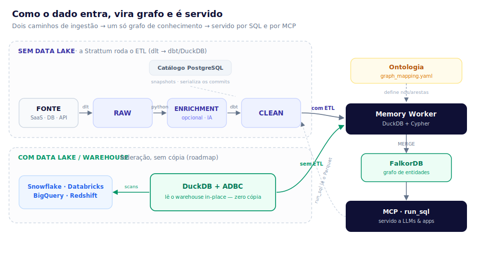

# Strattum — Benchmark do Lakehouse Aberto

> **De 2 bancos operacionais a um grafo de conhecimento, em minutos, num notebook.**
> 3 milhões de registros (PostgreSQL + MongoDB) → lakehouse aberto (DuckLake + Parquet/S3)
> → camada *clean* modelada → grafo de entidades — medido ponta a ponta.

Este documento reporta um benchmark **reprodutível** da plataforma Strattum rodando
**inteira num único MacBook (8 GB de RAM)**. O objetivo é responder, com números, a
uma pergunta simples: *quão rápido e quão barato qualquer empresa consegue transformar
os próprios dados operacionais em algo útil?*

---

## TL;DR

| O que | Volume | Tempo | Throughput | Pico de RAM |
|---|---:|---:|---:|---:|
| **Ingestão** PostgreSQL → lake | 2.000.000 linhas | **36,9 s** | ~54.200 linhas/s | 272 MB |
| **Ingestão** MongoDB → lake | 1.000.500 docs | **25,0 s** | ~40.500 docs/s | 272 MB |
| **Transformação** (dbt/DuckLake) | 3.000.500 linhas | **3,8 s** | ~795.000 linhas/s | 382 MB |
| **Sync incremental** (+150k) | 150.000 linhas | **3,5 s** | delta-only, 0 duplicatas | 267 MB |
| **Grafo de conhecimento** | 290.756 nós · 300.000 arestas | **126 s** ¹ | ~4.680 elem/s | 250 MB (worker) · 302 MB (FalkorDB) |

¹ Grafo numa **fatia representativa** (100k contratos + entidades ligadas); build otimizado
de 362 s → 126 s durante o benchmark (ver §4). Ingestão e *clean* rodaram no volume **cheio**.

**3 milhões de linhas ingeridas + modeladas em ~66 segundos, com pico de ~380 MB de RAM
por processo** — em hardware de mesa, sobre formatos 100% abertos (Parquet + catálogo
DuckLake), sem data warehouse proprietário e sem cluster.

---

## O cenário

Uma empresa média tem os dados espalhados: um **PostgreSQL** com o cadastro de pessoas,
um **MongoDB** com os contratos/processos, planilhas, um ERP. Ninguém "faz nada com data"
porque juntar tudo isso normalmente exige um projeto de meses, um data warehouse caro e
um time dedicado.

O benchmark simula exatamente esse caso com dados sintéticos realistas:

- **PostgreSQL — `users`**: 2.000.000 de usuários (id, nome, e-mail, CPF, cidade, timestamps).
- **MongoDB — 2 coleções**:
  - `contracts`: 1.000.000 de contratos, cada um com **duas partes** (`processante` e
    `processado`, ambos referenciando um usuário) + produto, status e valor;
  - `products`: 500 produtos (id → nome/categoria).
- **Incremento**: +100.000 usuários e +50.000 contratos, para medir o custo de um
  sync do dia seguinte.

O alvo: uma camada *clean* com **uma tabela de usuários** e **uma tabela de contratos**
(já com o `JOIN` das duas coleções do Mongo, trazendo o nome do produto), e um **grafo**
onde cada contrato conecta suas duas partes e seu produto.

---

## Setup (deliberadamente modesto)

| Item | Valor |
|---|---|
| Máquina | MacBook, Apple Silicon, 8 vCPU, **8 GB RAM** |
| Docker (VM Linux) | **3,8 GB** para todos os containers |
| Fontes | PostgreSQL 16, MongoDB 7 (containers) |
| Lakehouse | **DuckLake** (catálogo em Postgres) + **Parquet** em **MinIO** (S3) |
| Transformação | **dbt** rodando **DuckDB/DuckLake** nativo |
| Grafo | **FalkorDB** (grafo de entidades) |
| Orquestração | Prefect |

Nada aqui é "hardware de benchmark". É o que qualquer dev tem na mesa. O ponto é
justamente esse: **a arquitetura aberta escala para baixo** — roda no notebook hoje e no
cluster amanhã, sem trocar de formato.

---

## Resultados por estágio

### 1) Ingestão (bootstrap — carga cheia)

Cada conector **faz streaming** da fonte (cursor server-side no Postgres, cursor em lote no
Mongo) e grava Parquet no lake em micro-batches. Por isso o **pico de memória é constante
(~272 MB) independentemente do volume** — o dataset inteiro nunca é carregado na RAM.

| Fonte | Linhas | Tempo | Throughput | Pico RAM | Parquet gerado |
|---|---:|---:|---:|---:|---:|
| PostgreSQL `users` | 2.000.000 | 36,9 s | 54.200 l/s | 272 MB | 83 MB |
| MongoDB `contracts` | 1.000.000 | 24,7 s | 40.500 l/s | 272 MB | 85 MB |
| MongoDB `products` | 500 | 0,2 s | — | — | 36 KB |
| **Total** | **3.000.500** | **~62 s** | **~48.500 l/s** | **272 MB** | **~168 MB** |

> 3 milhões de linhas viram ~168 MB de Parquet colunar comprimido — a base já fica pronta
> para consulta analítica direta, sem cópia para um warehouse.

### 2) Transformação — camada *clean* (dbt sobre DuckLake)

O dbt lê o `raw` e materializa três tabelas *clean* no próprio lake. A `clean.contracts`
faz o **`JOIN` das duas coleções do Mongo** (contratos × produtos), normaliza tipos e traz
o nome do produto para cada contrato.

| Modelo | Linhas | Tempo |
|---|---:|---:|
| `clean.products` | 500 | 0,40 s |
| `clean.users` | 2.000.000 | 3,23 s |
| `clean.contracts` (join) | 1.000.000 | 3,44 s |
| **Total** | **3.000.500** | **3,8 s** |

Resultado: **0 contratos sem produto** (join íntegro), ~795 mil linhas/s. DuckDB sobre
Parquet transforma milhões de linhas em segundos — sem mover dado para fora do lake.

### 3) Sync incremental (o "dia seguinte")

Depois de +100k usuários e +50k contratos nas fontes, o mesmo pipeline roda de novo. O
cursor incremental lê **apenas o delta** (`updated_at > watermark`) e faz *merge* por chave
primária — nada é reprocessado.

| Fonte | Delta | Tempo | vs. bootstrap |
|---|---:|---:|---:|
| PostgreSQL | 100.000 | **2,2 s** | **~17× mais rápido** |
| MongoDB | 50.000 | **1,3 s** | ~19× mais rápido |

Verificado: `raw` foi para **exatamente** 2.100.000 / 1.050.000 linhas, **0 duplicatas**
(o *merge* delete-then-insert por PK dedupe corretamente) e o watermark avançou. O custo do
sync acompanha o **tamanho da mudança**, não o tamanho da base — é isso que torna a
plataforma barata em regime permanente.

### 4) Grafo de conhecimento (FalkorDB)

A ontologia mapeia a camada *clean* para um grafo: **`User`**, **`Contract`** e
**`Product`**, com as arestas **`PROCESSANTE`** e **`PROCESSADO`** (contrato → usuário) e
**`SOBRE`** (contrato → produto). A resolução de entidade é determinística (mesmo id →
mesmo nó), então as duas partes de cada contrato apontam para os nós de usuário corretos.

> **Por que uma fatia?** Materializar o grafo **completo** (2,1M usuários + 1,05M contratos
> ⇒ ~3,15M nós + ~3,15M arestas) exigiria **~3,3 GB só no FalkorDB** (extrapolado da medição
> real, ~510 bytes/elemento) — não cabe na VM Docker de 3,8 GB do notebook, que ainda divide
> RAM com Postgres/Mongo/MinIO. Então o grafo foi materializado sobre uma **fatia
> representativa** — 100k contratos + os 190.256 usuários referenciados + 500 produtos ≈
> **291k nós, 300k arestas** — medido, e a taxa projetada pro volume total. Ingestão e
> *clean* rodaram sempre no volume **cheio** (2M/1M).

O build passou por uma **otimização durante o próprio benchmark**. Estava fazendo **1 `MERGE`
por linha** (um round-trip ao FalkorDB por nó e por aresta); reescrevi o `execute_batch` do
memory-worker pra **agrupar cada lote num único `UNWIND $rows AS row ...`** (1 round-trip por
lote de ~500):

| Métrica | Antes (1 MERGE/linha) | Depois (UNWIND) | Projeção grafo cheio |
|---|---:|---:|---:|
| Nós | 290.756 | 290.756 | ~3,15M |
| Arestas | 300.000 | 300.000 | ~3,15M |
| Tempo de build | 362 s | **126 s** | ~22 min |
| Taxa | ~1.630 elem/s | **~4.680 elem/s** | — |
| Pico RAM (worker) | 255 MB | 250 MB | — |
| RAM FalkorDB | 302 MB | 302 MB | **~3,3 GB** |

**2,87× mais rápido**, resultado idêntico, **0 fallbacks**. O ganho local é "só" ~3× porque
na mesma máquina o round-trip é barato — o custo dominante virou o próprio `MERGE` no
FalkorDB + a leitura do lake. **Num FalkorDB remoto (produção, outro host), onde a latência
de rede domina, o UNWIND rende bem mais.** Próximo passo pra carga inicial de grafos grandes:
`falkordb-bulk-loader` (CSV → grafo, milhões/s).

**Qualidade:** 100% das arestas resolvidas — PROCESSANTE 100.000/100.000, PROCESSADO
100.000/100.000, SOBRE 100.000/100.000, **0 órfãs**. A resolução de entidade determinística
garante que as duas partes de cada contrato caem nos nós de usuário certos.

Sub-grafo real (um contrato e seu "digital twin") direto do FalkorDB:

```cypher
MATCH (c:Contract)-[:PROCESSANTE]->(a:User),
      (c)-[:PROCESSADO]->(b:User),
      (c)-[:SOBRE]->(p:Product)
RETURN c.contract_id, a.name, b.name, p.product_name, c.status, c.value LIMIT 2
```
```
contract_id | processante       | processado      | produto      | status    | valor
95152       | Usuário 400774    | Usuário 5093    | Produto 54   | encerrado | 42.933,20
88258       | Usuário 1968098   | Usuário 8993    | Produto 485  | encerrado | 126.069,85
```


_(Achados do benchmark no viz do grafo, já corrigidos: **(a)** o first-paint pedia 5.000 nós e
estourava (HTTP 500) em grafos grandes — cap baixado; **(b)** o first-paint trazia só os nós de
**entidade** e, num grafo hub-and-spoke (todo vínculo passa pelo **contrato**), isso pintava os
usuários **soltos, sem nenhuma conexão** — "só vejo os nós". Corrigido: o primeiro paint agora vem
de uma **amostra semeada por arestas** (via a query Cypher read-only), então já abre **conectado** —
os "digital twins" acima aparecem de cara, sem precisar clicar. A expansão por-nó ainda não devolve
todas as arestas de entrada — follow-up separado.)_

### A ontologia que gera esse grafo

O grafo acima não é hardcoded — sai de um **mapa declarativo** (`graph_mapping.yaml`): nós
`User`/`Product`/`Contract` (cada um lendo uma tabela `clean`) + arestas `PROCESSANTE`/`PROCESSADO`/`SOBRE`
ligando contrato → partes e produto. Como `postgres`/`mongodb` são *dynamic-schema* (o schema é do
cliente), esse mapa é **escrito por cliente** — aqui, à mão, como faria o FDE. Duas formas de criar/editar,
ambas gravando a **mesma** coisa, versionada:

- **Pela API** (FDE / automação): `PUT /v1/ontology` (salva) + `POST /v1/ontology/apply` (aplica) — foi
  assim que registrei a **Versão 4** deste benchmark.
- **Pela UI** (cliente): **Configurações → Ontologia → aba YAML → Editar → Salvar e aplicar**. O console
  valida o YAML *e* as colunas contra as tabelas `clean` reais, salva e aplica num clique, com histórico
  de versões pra rollback.


---

## Footprint & projeção no cliente

### Quanto os dados ocupam (medido)

| Onde | Tamanho | Nota |
|---|---:|---|
| **Lake — raw (Parquet/S3)** | **171 MB** | os 3,15M registros comprimidos |
| Lake — clean | 174 MB | tabelas materializadas |
| **Grafo — FalkorDB (RAM)** | **302 MB** | 290k nós + 300k arestas, in-memory (~510 B/elem) |
| Grafo — snapshot em disco (RDB) | 84 MB | persistência comprimida |
| *(comparação)* Postgres de origem | 306 MB | os mesmos 2,1M users, OLTP |
| *(comparação)* Mongo de origem | 170 MB | os mesmos 1,05M contratos |

Dois pontos que viram argumento comercial: **(a)** o Parquet aberto (171 MB) é **mais
compacto que os bancos operacionais de origem** (306 + 170 MB) — o dado continua seu,
consultável por qualquer engine, sem cópia proprietária; **(b)** ingestão e clean têm pico
de RAM **constante** (272–394 MB) *independente do volume* — streaming, não carregam o
dataset.

### O que isso aguenta num servidor de verdade

O benchmark rodou num notebook de 8 GB de propósito. Num servidor, cada estágio escala
diferente — e o gargalo **não** é onde a maioria pensa.

**Lake (Parquet em S3) — praticamente ilimitado.** A ~56 bytes/linha comprimido, é object
storage barato:

| Linhas | Parquet no lake | Storage (~US$ 0,023/GB/mês) |
|---:|---:|---:|
| 100 milhões | ~5,6 GB | ~US$ 0,13/mês |
| 1 bilhão | ~56 GB | ~US$ 1,30/mês |
| 10 bilhões | ~560 GB | ~US$ 13/mês |

**Ingestão — linear no tempo, RAM constante** (~48,5k linhas/s, ~272 MB fixos → nunca dá
OOM): 100M linhas ≈ **~34 min**, 1B linhas ≈ **~5,7 h**. Com mais cores / conectores em
paralelo / S3 mais rápido, encurta.

**Clean (dbt/DuckDB)** paraleliza por core e derrama pra disco — 100M linhas em ~poucos
minutos num servidor comum.

**Incremental — o segredo do custo baixo.** O sync do dia-a-dia custa o **tamanho da
mudança**, não o da base. Um cliente com 1 bilhão de linhas mas 5 milhões mudando por dia
paga ~5M/dia (~2 min) — **não** 1 bilhão. Em regime permanente, a conta é sempre do delta.

**Grafo (FalkorDB) — limitado por RAM**, mas um servidor normal segura dezenas a centenas de
milhões de entidades (a ~510 B/elemento medido, com ~40% de folga pra RAM de query):

| RAM do servidor | Elementos no grafo | ≈ Entidades (nós) |
|---:|---:|---:|
| 16 GB | ~19M | ~9M |
| 32 GB | ~38M | ~19M |
| 64 GB | ~75M | ~37M |
| 128 GB | ~150M | ~75M |
| 256 GB | ~300M | ~150M |

O FalkorDB oficialmente vai a **bilhões de arestas** com hardware adequado, queries em
milissegundos (GraphBLAS). O limite prático da **carga inicial** é a velocidade de escrita —
hoje ~4.680 elem/s (com UNWIND); pra grafos grandes, o `falkordb-bulk-loader` faz
milhões/s. Depois disso, o worker mantém o grafo **por delta** (barato).

**Exemplo — cliente médio** (2M clientes + 8M contratos + ~100k mudanças/dia):
- **Lake:** ~600 MB de Parquet (~US$ 0,02/mês de storage).
- **Ingestão inicial** ~3–4 min · **clean** ~1 min.
- **Grafo:** ~10M nós + ~24M arestas ≈ 34M elementos → cabe num servidor de **~48 GB**;
  carga inicial via bulk-loader em minutos.
- **Sync diário:** ~100k linhas → **segundos**.

Tudo num único servidor **BYOC** (na nuvem do próprio cliente), sem data warehouse
proprietário. **O que escala pra bilhões (lake, ingestão, incremental) é barato; o que é
limitado por RAM (grafo) sobe com o servidor — e o custo permanente é sempre o do delta.**

---

## Antes → Depois (console Strattum)

Toda a jornada é visível no console — sem SQL na mão.

**Antes — catálogo vazio, memória vazia:**


**Depois — 3M linhas catalogadas + grafo materializado:**

Catálogo: 3 tabelas `raw` + 5 `clean` = 8 no total (era 0), sem ninguém escrever SQL de ETL.


Camada *clean* com as contagens reais — `users` **2.100.000**, `contracts` **1.050.000**, `products` 500, mais as fatias do grafo:


Grafo de entidades no Memory — o primeiro paint agora abre **conectado**: uma amostra semeada por
arestas (~800 nós) traz os **contratos** (âmbar) ligando suas duas partes — os **usuários** (azul) —
e o **produto** (verde). São os "digital twins" da §4, repetidos ~200×. O esquema do padrão:


E o mesmo **ao vivo no console** — repare no rodapé: `800 entidades · 627 conexões` (antes: 0 conexões):


---

## Como funciona (4 passos)



1. **Conecte** a fonte no console (PostgreSQL, MongoDB, …). As credenciais ficam no
   registro de conectores; a seleção de tabelas/coleções e o modo de sync
   (full/incremental, cursor, PK) ficam no estado do conector.
2. **Ingira** para o `raw` do lake — Parquet em S3/MinIO, catalogado pelo **DuckLake**.
   Streaming ponta a ponta: memória constante, incremental por cursor.
3. **Modele** com **dbt** rodando DuckDB nativo sobre o lake: normalização, `JOIN`s,
   tipagem → camada `clean`, materializada de volta no próprio lake.
4. **Construa o grafo**: a ontologia mapeia `clean` → nós e arestas; o worker resolve
   entidades e materializa no FalkorDB. O resultado aparece no Memory do console.

Tudo sobre **formatos abertos** (Parquet + catálogo relacional). Sem lock-in de warehouse,
sem cópia proprietária dos dados.

---

## Por que isso importa

- **Qualquer empresa consegue.** Se roda num notebook de 8 GB com 3M de linhas em ~1 minuto,
  roda no seu ambiente com os seus dados.
- **Barato em regime permanente.** O sync diário custa o **tamanho do delta**, não o da base.
- **Aberto por construção.** Parquet + DuckLake: os dados continuam seus, consultáveis por
  qualquer engine, sem reimportar.
- **Do dado bruto ao conhecimento.** Não para no "data lake": entrega camada modelada +
  grafo de entidades pronto para IA/contexto.

---

## Metodologia & reprodutibilidade

- **Medição:** cada estágio rodou como processo isolado sob `/usr/bin/time -l` (tempo de
  parede + *maximum resident set size*). Throughput = linhas ÷ tempo do estágio.
- **Dados:** sintéticos e determinísticos (geradores versionados). `updated_at` do
  incremento estritamente maior que o watermark do bootstrap, para exercitar o delta real.
- **Código de produção:** a ingestão usa os conectores/flows reais da plataforma
  (`sync_resource_to_raw`), não um caminho de benchmark à parte. O `clean` usa os mesmos
  modelos dbt. O grafo usa o mesmo `MemoryWorkerPipeline`.
- **Honestidade de escopo:** ingestão e clean no volume cheio (2M/1M); grafo em fatia
  representativa com projeção, pela restrição de RAM do notebook (ver §4).
- **O benchmark virou QA:** de brinde, ele expôs (e este relatório corrigiu) o gargalo de
  escrita do grafo — 1 `MERGE`/linha → `UNWIND` batch, **2,87× mais rápido** — e o cap de
  first-paint do viz que estourava em grafos grandes.

_Benchmark executado em 2026-07-19; grafo otimizado (UNWIND) no mesmo dia._
