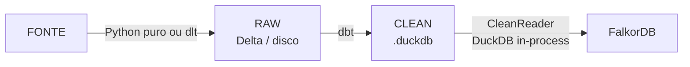
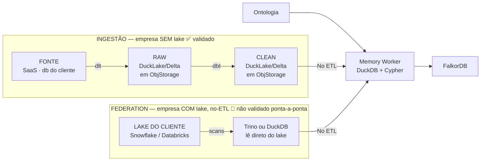

# Arquitetura 2.0 — Lake aberto + Federation

> **A arquitetura-alvo.** Tira o `.duckdb` monolítico e abre o storage: RAW e CLEAN viram
> **lake aberto** (DuckLake **ou** Delta) em object storage, com dois caminhos convergindo
> no grafo — **ingestão** (nós trazemos o dado) e **federation** (o cliente já tem lake,
> lido sem ETL).
>
> Como roda **hoje** (e onde quebra): [1.0-atual](../1.0-atual.md). O que já **validamos**:
> [descobertas](descobertas.md). O que falta **decidir/validar**:
> [pontos-a-verificar](pontos-a-verificar.md). O **backlog**: [tarefas](tarefas/). Como
> **migrar**: [migracao](migracao.md). Índice geral: [../README](../README.md).

Legenda: ✅ decidido/validado · 🟡 decidido, variante em aberto · 🛑 não validado

---

## O quadro (de onde saímos, pra onde vamos)

### Hoje (1.0)

🛑 **quebra com alguns milhões de registros** (conector caseiro segura a tabela na RAM) ·
🛑 **escrita concorrente** (`.duckdb` single-writer) · 🛑 **sem incremental** (tudo full
refresh) · 🛑 **CLEAN sem `updated_at` → full load** no grafo (round-trip por linha).

### Futuro (2.0)

> Fonte: quadro de arquitetura do time. SVG de referência:
> [diagramas/2.0-visao-geral.svg](../diagramas/2.0-visao-geral.svg).

---

## O que já está decidido (não é mais discussão)

| # | Decisão | Status | Base |
|---|---|---|---|
| 1 | **Ingestão com `dlt`** (backend `connectorx`) — resolve o OOM do conector caseiro | ✅ | [descobertas §1](descobertas.md) |
| 2 | **Transform com `dbt`** (DuckDB como engine, lendo o lake via scan) | ✅ | [1.0-atual](../1.0-atual.md) |
| 3 | **Lake aberto** — RAW **e** CLEAN saem do `.duckdb` monolítico | ✅ | [descobertas §3](descobertas.md) |
| 4 | **Object storage** (MinIO / S3) como storage do lake | ✅ | [descobertas §2](descobertas.md) |
| 5 | **Federation** — para empresa com lake, ler direto sem ETL | ✅ (conceito) | [descobertas §5](descobertas.md) |

## O que ainda está em aberto

| # | Decisão pendente | Onde |
|---|---|---|
| A | **DuckLake vs Delta** — qual formato do lake | [pontos §1](pontos-a-verificar.md) |
| B | **Trino vs DuckDB** — qual engine lê o lake do cliente na federation | [pontos §2](pontos-a-verificar.md) |
| C | **Como o `catalog-api` lê os dois formatos** | [pontos §6](pontos-a-verificar.md) · [migracao](migracao.md) |
| D | **Como o `memory-worker` muda** (o `CleanReader`) | [pontos §7](pontos-a-verificar.md) · [migracao](migracao.md) |
| E | Performance do grafo · data quality · deep-dive por conector · **grafo em container separado** | [pontos-a-verificar](pontos-a-verificar.md) |

---

## O invariante (por que a migração é segura)

> 💡 **DuckDB é engine, não storage.** O `.duckdb` é um formato de arquivo *opcional* (como
> o `.sqlite`). Trocá-lo por DuckLake/Delta mantém a engine e abre o storage.

E do lado do grafo, **o formato é irrelevante daqui pra frente**: o `memory-worker` recebe
*dicts* (uma linha da CLEAN) e escreve *Cypher* — a linha vira `MERGE` independente de vir
de `.duckdb`, DuckLake ou Delta, da nossa CLEAN ou do lake federado do cliente. É o que
torna as duas decisões abertas (A e B) **reversíveis** e a federation **plugável** no mesmo
caminho de ingestão.
