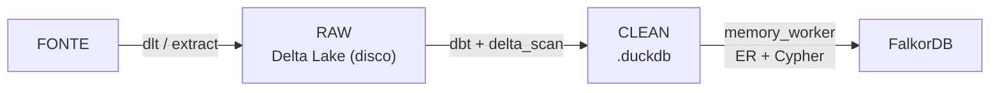
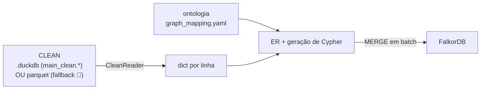

# Arquitetura 1.0 — atual (o que roda hoje)

> **Só o que roda hoje, validado.** Como o pipeline funciona, como os dados chegam ao
> grafo, e onde quebra em escala. Não é proposta — é o estado atual. A proposta (lake
> aberto + federation) e o que falta estão na [arquitetura 2.0](2.0-lake-aberto/).
> Índice: [README](README.md).

Legenda: ✅ atual/validado · 🛑 limite conhecido

---

## 1. Visão geral

ELT **single-node** (uma VM, sem cluster). O dado sai da fonte, aterrissa na RAW, é
transformado na CLEAN e vira grafo.



| Peça | O que é |
|---|---|
| **dlt / conectores** | Extraem da fonte em Python (geradores). RAW fiel à fonte. |
| **Delta Lake** | Formato de arquivo (parquet + log) da camada **RAW**, no disco da VM. |
| **DuckDB** | Engine OLAP embarcado. Roda o SQL do dbt sobre o Delta. A **CLEAN** vive aqui (`strattum.duckdb`). |
| **dbt** | Transformação RAW→CLEAN (normaliza email, `external_id`, joins, UTC). |
| **Prefect** | Orquestra os flows (server + workers). |
| **FalkorDB** | Banco de grafo final (nós/arestas), porta 6380. |

**Escala = vertical** (mais RAM/CPU na VM). Não há paralelismo distribuído.
Diagrama dos containers: [diagramas/1.0-containers.svg](diagramas/1.0-containers.svg).

### Conectores: dlt vs camada caseira

Hoje **só o `airtable` define resources dlt** (`@dlt.source` / `@dlt.resource`). Todo o
resto herda de `StratumConnector` — a camada caseira: `extract()` é um gerador, o flow
coleta e chama `write_delta`.

> 🛑 A camada caseira **não tem backpressure** → segura a tabela inteira na RAM → OOM em
> 1M+ linhas (§6). O dlt *gerenciaria* memória via `dlt.pipeline().run()`, mas **nenhum
> flow usa isso hoje** — nem o airtable ([airtable_sync.py:236](../../strattum-data/services/pipelines/src/flows/airtable_sync.py#L236)).

> **Engine do dlt (importante):** o dlt **não é um engine** — é um framework de
> extract/load que delega. **Leitura** da fonte via *backend*: a escolha é **`connectorx`**
> (Rust, leitura paralela, zero-copy pra Arrow). **Escrita** conforme o destino: Delta →
> **delta-rs** (`deltalake`, Rust); DuckDB → **DuckDB**; DuckLake → DuckDB+catálogo. No
> caminho `fonte → RAW` o músculo é **connectorx (ler) + delta-rs (escrever)** — ambos Rust,
> sem JVM. O **DuckDB** só entra depois (dbt no `RAW → CLEAN`, e o `memory_worker`).
> Ver [descobertas §1](2.0-lake-aberto/descobertas.md).

---

## 2. Estado da sincronização

**`connector_state`** — **uma linha por `(connector, resource)`**. Guarda o
watermark/cursor como JSON. A próxima run daquela tabela lê `WHERE updated_at > esse valor`.

**`connector_sync_progress`** — histórico e status em tempo real por execução
(`running` → `completed`/`failed`, `records_synced`, `finished_at`). Alimenta a UI.

---

## 3. RAW → CLEAN (dbt)

**dbt não tem engine própria:** compila o SQL e o **DuckDB executa**
`CREATE OR REPLACE TABLE clean.x AS <select>`, lendo a RAW com `delta_scan('/data/raw/...')`.
O Prefect chama `dbt run --select clean.<models>` por **subprocess após cada sync**
([flows/utils.py](../../strattum-data/services/pipelines/src/flows/utils.py)).

- 🛑 Todos os 42 models são `materialized='table'` → **full-refresh sempre**: reconstrói a
  tabela inteira a cada run, mesmo se o RAW não mudou.
- 🛑 **DuckDB é single-writer** (file lock por processo). Dois flows terminando juntos
  disputam o lock do `strattum.duckdb` e o 2º crasha (`IOException: Could not set lock`).

> Números medidos de escala e a decisão de serialização estão em
> [descobertas](2.0-lake-aberto/descobertas.md).

---

## 4. Incremental vs Full

**Full refresh** — relê a tabela inteira e sobrescreve a RAW (`mode="overwrite"`). Para
tabelas pequenas ou sem coluna de tempo.

**Incremental (por watermark)** — lê só o que mudou: coluna de cursor (timestamp) → filtra
`WHERE updated_at > {último valor}` → salva o novo máximo → `write_delta` faz **merge/upsert
por `primary_key`**.

> 🛑 Sem `primary_key`, cursor GTE (`>=`) **duplica** linhas entre RAW e CLEAN
> (ver [pontos-a-verificar](2.0-lake-aberto/pontos-a-verificar.md)).

---

## 5. Como os dados vão para o grafo

O **`memory_worker`** (serviço em `strattum-ai`) lê a camada **CLEAN** e materializa o grafo
no FalkorDB — **só para tabelas mapeadas** em `graph_mapping.yaml`. É um **flow Prefect**,
disparado **automaticamente ao fim do sync** de um conector (o `strattum-data` chama
`_trigger_memory_worker` depois do dbt).



O ponto-chave: **não existe "carregar arquivo no FalkorDB".** O FalkorDB só fala **Cypher**
(protocolo Redis). O worker faz, linha por linha:

1. **Lê o `graph_mapping.yaml`** (nós, arestas, timeline; cada `source: clean/<tabela>`).
2. **Lê a CLEAN** com o `CleanReader`
   ([reader.py](../../strattum-ai/services/memory-worker/memory_worker/reader.py)) — **DuckDB
   in-process**, com **dois backends escolhidos em runtime**: (a) se o `{storage_root}/strattum.duckdb`
   **existe** e a source começa com `clean/` → lê `SELECT ... FROM main_clean.<tabela>`; (b) senão,
   **fallback para parquet** (`read_parquet('{storage_root}/{source}/*.parquet')`). Devolve **um
   dict por linha** em streaming (1000/vez), filtrando por watermark (`updated_at > X`).
3. **Entity resolution** — normaliza email/phone/cnpj e resolve o `entity_id`
   ([pipeline.py](../../strattum-ai/services/memory-worker/memory_worker/pipeline.py)).
4. **Gera Cypher `MERGE`**
   ([cypher_generator.py](../../strattum-ai/services/memory-worker/memory_worker/cypher_generator.py)):

   ```cypher
   MERGE (n:Person {entity_id: $entity_id})
   SET n.email = $email, n.name = $name, n.updated_at = $updated_at
   ```
5. **Escreve no FalkorDB em batch** — flush a cada 200 statements via `execute_batch`
   ([falkordb_client.py](../../strattum-ai/services/memory-worker/memory_worker/falkordb_client.py)).

> 🛑 **Quirk observado: o grafo está carregando via PARQUET, não do `.duckdb` — por algum motivo.**
> Apesar do `CleanReader` **preferir** o `main_clean.*` do `strattum.duckdb`, na prática o grafo
> tem carregado pelo **fallback de parquet** (backend "b" acima). A causa mais provável é o
> `strattum.duckdb` **não estar sendo encontrado em `storage_root`** (path/config divergente)
> ou a source não bater no prefixo `clean/`, fazendo o reader **cair no `read_parquet`**. Efeito
> colateral disso é o mesmo do [run_sql do MCP](../../strattum-ai/services/skills-api/src/skills_api/routers/query.py):
> **só enxerga a CLEAN que existe como parquet** (hoje só o gdrive exporta) — o resto do
> `main_clean` (no `.duckdb`) fica invisível pra esse caminho. **Por que exatamente cai no
> fallback? A investigar** (checar `storage_root` do worker vs `DBT_DUCKDB_PATH`, e se a clean
> está sendo materializada em parquet em algum ponto). Some quando a CLEAN virar lake aberto
> (2.0), onde há um formato único.

> 💡 **O formato do storage é irrelevante daqui pra frente.** Como o worker recebe *dicts* e
> escreve *Cypher*, a linha da CLEAN vira `MERGE` independente de vir de `.duckdb`, parquet,
> Delta ou DuckLake. O gargalo de escala **não está no grafo** — está no extract do conector (§6).

---

## 6. Limitações 🛑 (por que quebra em 1M+ linhas)

- 🛑 **#1 (crítico) — tabela inteira na RAM.** O conector caseiro dá `append` da tabela toda
  numa lista antes de escrever → heap cresce com N → **OOM ~1–2M linhas** (validado:
  [folder 01](../../experimentacoes/01-ingestao-fonte-para-raw/RESULTADOS.md)).
- 🛑 **#2 — row-by-row em Python** (GIL, overhead).
- 🛑 **#3 — single VM, sequencial, storage local.**

> A solução (dlt + connectorx) e os números estão em
> [descobertas](2.0-lake-aberto/descobertas.md); o que fazer, em [tarefas](2.0-lake-aberto/tarefas/).
