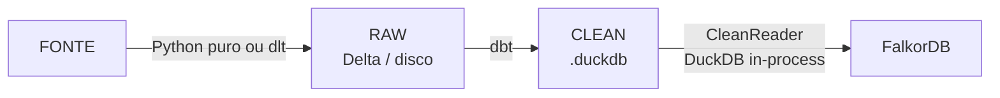
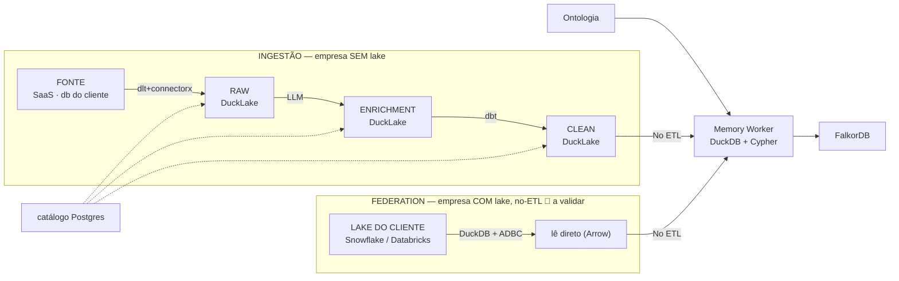

# Arquitetura 2.0 — Lake aberto + Federation

> **A arquitetura-alvo.** Tira o `.duckdb` monolítico e abre o storage: RAW e CLEAN viram
> **lake aberto** (DuckLake **ou** Delta) em object storage, com dois caminhos convergindo
> no grafo — **ingestão** (nós trazemos o dado) e **federation** (o cliente já tem lake,
> lido sem ETL).
>
> Como roda **hoje** (e onde quebra): [1.0-atual](../1.0-atual.md). O que já **validamos**:
> [descobertas](descobertas.md). O que falta **decidir/validar**:
> [pontos-a-verificar](pontos-a-verificar.md). O **backlog**: [tarefas](tarefas/). Como
> **migrar**: [migracao](tarefas/01-lakehouse/migracao.md). Índice geral: [../README](../README.md).

Legenda: ✅ decidido/validado · 🟡 decidido, variante em aberto · 🛑 não validado

---

## O quadro (de onde saímos, pra onde vamos)

### Hoje (1.0)

🛑 **quebra com alguns milhões de registros** (conector caseiro segura a tabela na RAM) ·
🛑 **escrita concorrente** (`.duckdb` single-writer) · 🛑 **sem incremental** (tudo full
refresh) · 🛑 **CLEAN sem `updated_at` → full load** no grafo (round-trip por linha).

### Futuro (2.0)

> Storage = **DuckLake** (catálogo Postgres, dados em object storage). Federation =
> **DuckDB + ADBC**. Diagrama polido: [diagramas/2.0-visao-geral.svg](../diagramas/2.0-visao-geral.svg).

---

## O que já está decidido (não é mais discussão)

| # | Decisão | Status | Base |
|---|---|---|---|
| 1 | **Ingestão com `dlt` + `connectorx`** — resolve o OOM do conector caseiro | ✅ | [descobertas §1](descobertas.md) |
| 2 | **Transform com `dbt`** (DuckDB como engine, lendo o lake via scan) | ✅ | [1.0-atual](../1.0-atual.md) |
| 3 | **Lake = DuckLake** (catálogo Postgres) — RAW/enrichment/CLEAN saem do `.duckdb` | ✅ | [descobertas §3](descobertas.md) |
| 4 | **Object storage** (MinIO / S3) como storage do lake | ✅ | [descobertas §2](descobertas.md) |
| 5 | **Federation = DuckDB + ADBC** — lê Snowflake/Databricks (Arrow) sem ETL | ✅ | [descobertas §5](descobertas.md) |
| 6 | **Camada `enrichment` (LLM)** entre RAW e CLEAN | ✅ | [descobertas §6](descobertas.md) |

## O que ainda está em aberto

| # | Aberto (validar/medir — não é mais escolha) | Onde |
|---|---|---|
| A | ✅ **DuckLake aguentou 2M+1M** (benchmark: streaming, RAM 272 MB constante, clean 3M em 3,8s) — resta **concorrência multi-conector** no mesmo model | [tarefa 01](tarefas/01-lakehouse/) · [benchmark](../../../BENCHMARK-LAKEHOUSE.md) |
| B | **Maturidade da extensão ADBC** (comunidade) p/ Snowflake/Databricks | [tarefa 03](tarefas/03-federation/) · [pontos §4](pontos-a-verificar.md) |
| C | **`run_sql` só lê parquet — nem olha a CLEAN** (atachar o catálogo DuckLake) | [tarefa 01](tarefas/01-lakehouse/) · [migracao](tarefas/01-lakehouse/migracao.md) |
| D | **Migração via classe `LakeStore`** (worker, catalog-api, run_sql leem o lake) | [tarefa 01 §E](tarefas/01-lakehouse/) · [migracao](tarefas/01-lakehouse/migracao.md) |
| E | ✅ **Performance do grafo medida** (benchmark: `UNWIND` 2,87×, footprint ~510 B/elem) · resta data quality · deep-dive por conector · **grafo em container separado** | [pontos §1/§3](pontos-a-verificar.md) · [benchmark](../../../BENCHMARK-LAKEHOUSE.md) |

---

## O invariante (por que a migração é segura)

> 💡 **DuckDB é engine, não storage.** O `.duckdb` é um formato de arquivo *opcional* (como
> o `.sqlite`). Trocá-lo por DuckLake/Delta mantém a engine e abre o storage.

E do lado do grafo, **o formato é irrelevante daqui pra frente**: o `memory-worker` recebe
*dicts* (uma linha da CLEAN) e escreve *Cypher* — a linha vira `MERGE` independente de vir
de `.duckdb`, DuckLake ou Delta, da nossa CLEAN ou do lake federado do cliente. É o que
torna as duas decisões abertas (A e B) **reversíveis** e a federation **plugável** no mesmo
caminho de ingestão.
